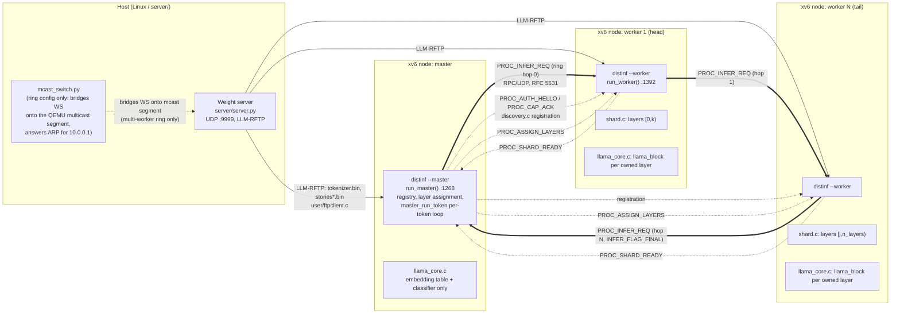

# F1 — System Architecture (flowchart)

Weight server, master, the N workers, the ring, and the transport between them, drawn
from `server/server.py`, `server/mcast_switch.py`/`boot.sh`'s SLIRP networking, and
`user/distinf.c`'s master/worker roles.

Solid double arrows: the per-token ring hop path (the hot path, F4/F5). Dashed
arrows: control-plane RPCs (registration, layer assignment, shard-ready) that run
once per session, not once per token. The single-node configuration (`llama.c`) is
the degenerate case of this diagram with zero workers: `llama_core.c` runs every
layer locally and only the weight-server edge exists.
