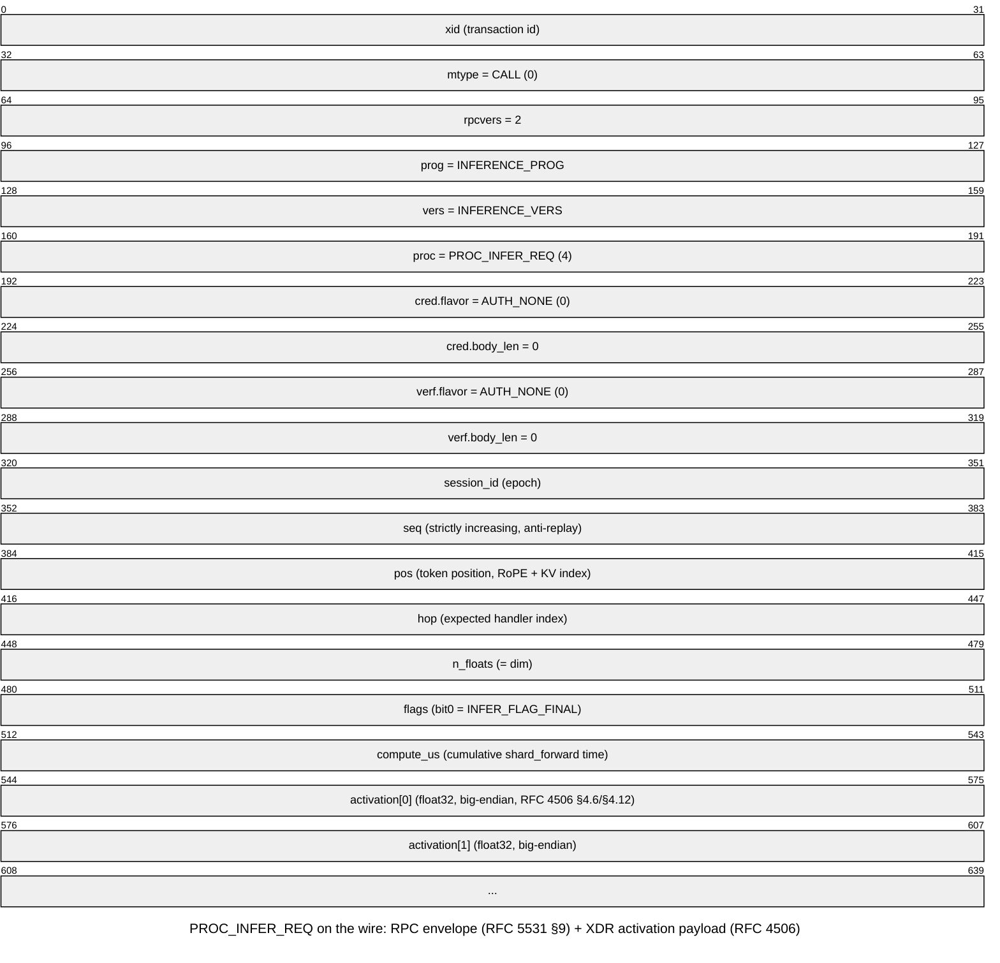

# F2 — Wire Format: RPC Envelope + XDR Activation Message (packet-beta)

Source: `user/rpc.h` (RFC 5531 §9 `call_body`/`rpc_msg` envelope) and `user/distinf.h`
(`infer_hop_t`, the `PROC_INFER_REQ` payload — one ring-hop activation message). All
multi-byte fields are 32-bit big-endian per RFC 4506 §4.2; the activation array is
IEEE 754 binary32, canonical big-endian, RFC 4506 §4.6/§4.12.

The envelope (xid through verf.body_len, 40 bytes) is identical across every RPC
procedure; only `proc` (word 5) and the payload after it change. The payload here
(`infer_hop_t`, `distinf.h:87-95`, 7 words = 28 bytes) is followed by `n_floats`
activation floats — at `dim=768` that is 3072 bytes of floats, for a total payload of
3100 bytes, deliberately kept under `RPC_PAYLOAD_MAX` (4096, `rpc.h:177`) but above
the 1500-byte Ethernet MTU, so the header comment in `distinf.h:22-25` notes this is
by design: every hop exercises IP fragmentation/reassembly (RFC 791) rather than
leaving that path untested.
