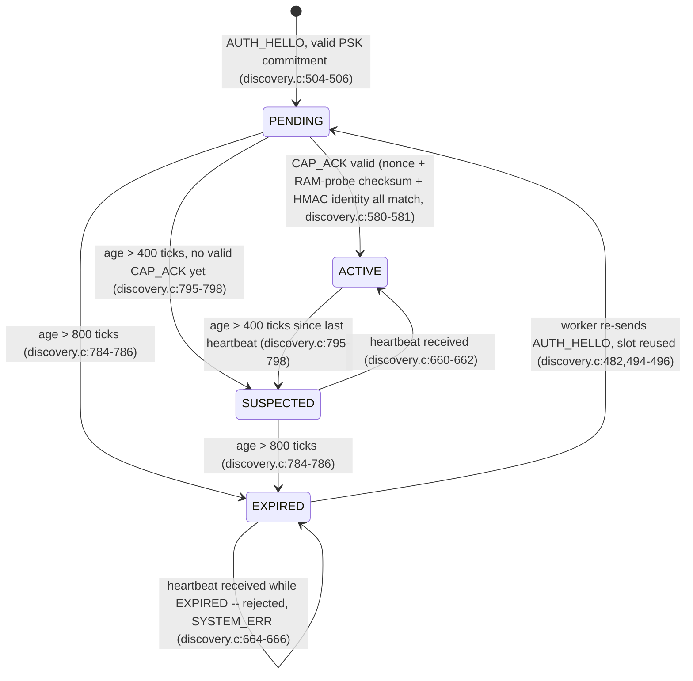

# F3 — Worker Lifecycle (stateDiagram-v2)

Built from `user/discovery.h` (states, constants) and `user/discovery.c` (transitions),
not from `diagrams/state_diagram.png`, which does not match the code (see divergence
paragraph below).

Real timing constants (`user/discovery.h:18-25`): `HEARTBEAT_INTERVAL_TICKS = 200`,
`SUSPECTED_TIMEOUT = 400 ticks` (2 missed heartbeats), `EXPIRED_TIMEOUT = 800 ticks`
(4 missed heartbeats). These are **ticks**, not milliseconds, despite every call site
passing `uptime()` into a parameter named `now_ms` (see Observations Log #2) — the
diagram below labels transitions with tick counts to stay accurate to the code.

## Where `diagrams/state_diagram.png` is wrong

The shipped hand-drawn diagram invents a fifth state, "unregistered worker," with a
`worker pending --timeout--> unregistered worker` edge (the slot is freed if the
capability probe is never completed) and a separate `hello` edge back into `pending`.
Neither exists in the registry code:

1. **There is no "unregistered" state.** An unregistered worker simply has no
   registry entry (`registry[i].info.worker_id == 0` is the sentinel for an empty
   slot, not a tracked state) — `WORKER_PENDING/ACTIVE/SUSPECTED/EXPIRED` are the
   only four values `worker_entry_t.state` ever takes (`discovery.h:13-16`).
2. **A PENDING worker that never completes the capability probe is not freed on
   timeout.** `discovery_expire_workers` (`discovery.c:769-800`) does not special-case
   `WORKER_PENDING` at all — it ages *every* non-EXPIRED slot by the same
   `SUSPECTED_TIMEOUT`/`EXPIRED_TIMEOUT` thresholds regardless of current state, so a
   stalled PENDING worker is walked through `PENDING → SUSPECTED → EXPIRED` exactly
   like a stalled ACTIVE one, not dropped back to "unregistered." This is not a
   guess: the code says so directly, in a comment at `discovery.c:777-782`, which
   explicitly calls this out as "a known divergence from the maintainer's lifecycle
   diagram" — i.e. the bug in the diagram (not the code) was already known and left
   undocumented anywhere but that one inline comment.
3. **Re-registration is EXPIRED → PENDING, not "→ unregistered → pending."** When an
   EXPIRED worker sends a fresh `AUTH_HELLO`, `handle_auth_hello` finds its existing
   (expired) slot and reuses it directly, setting the state straight back to PENDING
   (`discovery.c:482, 494-496, 506`) — there is no intermediate state.
