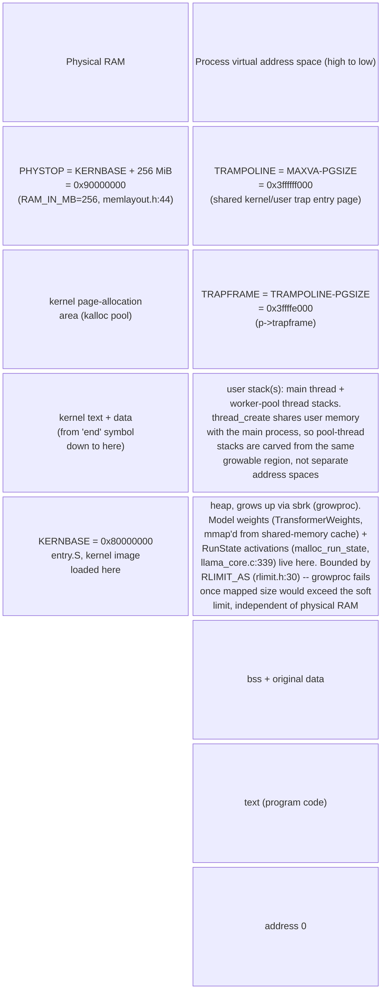

# F6 — Node Memory Map (block-beta)

Physical layout from `kernel/memlayout.h`; virtual layout top addresses (`MAXVA`,
`TRAMPOLINE`, `TRAPFRAME`) from `kernel/riscv.h:427-430` and `memlayout.h:65-67`; the
trampoline-region placement is independently confirmed live — the gdb trace captured
for the reverse-engineering task (`docs/transcripts/gdb_kernel_trace.txt`) shows
frame `#3` returning to `0x3ffffff124`, inside `TRAMPOLINE = MAXVA - PGSIZE =
0x3ffffff000`, exactly where the static header says user code re-enters the kernel
after a trap.

Two address spaces, drawn as two separate columns (physical RAM the kernel manages
directly; the per-process virtual address space every user program, including
`llama`, runs in) rather than one continuous range, since a physical address and a
virtual address here are never the same number.

Only the physical-layout block and the two fixed top-of-VA pages (`TRAMPOLINE`,
`TRAPFRAME`) are constants read from the kernel headers/binary; the heap/stack split
below them is the ordinary xv6 user layout (`memlayout.h`'s own comment block,
"text / data+bss / fixed-size stack / expandable heap") with the model weights and
activation buffers identified as the heap's largest occupants from
`malloc_run_state`/`memory_map_weights` in `user/llama_core.c`. `RLIMIT_AS` is the
address-space limit this figure is captioned against: it caps how far `HEAP` may
grow regardless of how much physical RAM the host QEMU process is given.
