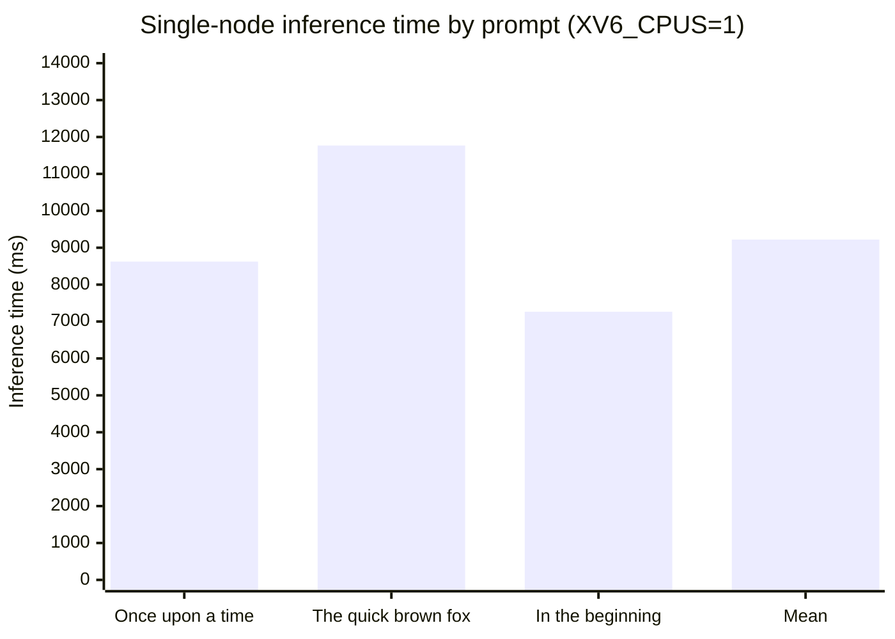
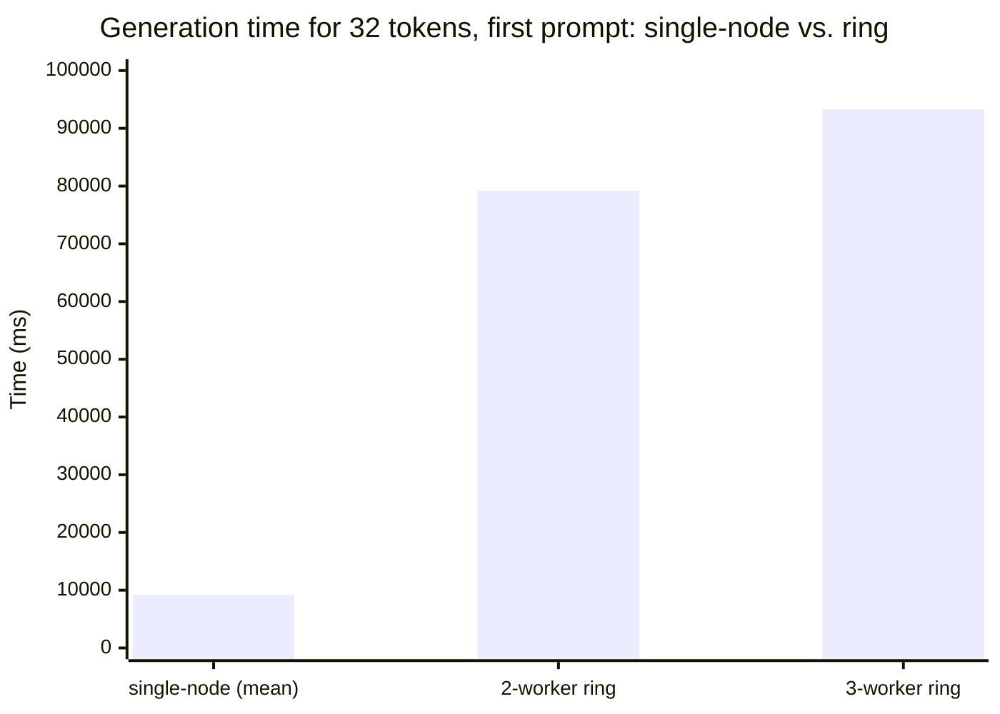

# F7 — Baseline Graphs (xychart-beta)

Plots of the measurements in `docs/figures/baseline_measurements.md`.

## Single-node inference time per prompt (ms)

## Ring generation time: single-node mean vs. 2-worker vs. 3-worker (ms)

## Per-token latency breakdown, ring only: compute vs. network (µs/token)

```mermaid
xychart-beta
    title "Per-token latency breakdown: compute vs. network wire time"
    x-axis ["2-worker ring", "3-worker ring"]
    y-axis "Microseconds per token" 0 --> 2200000
    bar "compute_us" [466767, 382276]
    bar "network (rtt - compute)" [1638610, 2123684]
```

Reading the three together: single-node is fastest in absolute terms at this model
scale (F7.2); adding workers makes each individual token slower, not faster, because
per-token network round-trip time on the emulated segment (F7.3) grows faster with
worker count than the compute time saved by sharding shrinks — pipeline parallelism
here is bottlenecked by transport, not compute, exactly as the Method section of the
baseline measurements notes.
