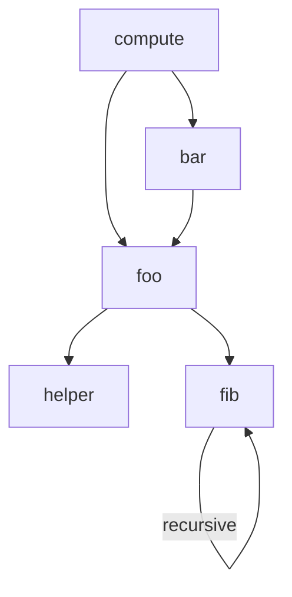

# Warm-Up: Call Graph Recovered from `warmup/build/challenge`

## Method

All facts below come from **static inspection only** — the binary was never executed:

```
riscv64-unknown-elf-nm build/challenge | grep -E ' [tT] '
riscv64-unknown-elf-objdump -d --disassemble=<fn> build/challenge
```

`nm` gave the complete function list and their addresses:

| Address | Function |
|---|---|
| `0x100e8` | `fib` |
| `0x1013e` | `helper` |
| `0x10160` | `foo` |
| `0x101a6` | `bar` |
| `0x101ea` | `compute` |

Disassembling each function and reading every `jal` (jump-and-link) instruction — RISC-V's call
instruction — gives every call site and its target:

| Caller | Address | Instruction | Target |
|---|---|---|---|
| `compute` | `0x101fe` | `jal 10160` | `foo` |
| `compute` | `0x1021a` | `jal 101a6` | `bar` |
| `bar` | `0x101c4` | `jal 10160` | `foo` |
| `bar` | `0x101d2` | `jal 10160` | `foo` |
| `foo` | `0x10174` | `jal 1013e` | `helper` |
| `foo` | `0x1018e` | `jal 100e8` | `fib` |
| `fib` | `0x10116` | `jal 100e8` | `fib` |
| `fib` | `0x10128` | `jal 100e8` | `fib` |
| `helper` | — | (no `jal` in its body) | leaf, calls nothing |

## Call Graph



## The Three Required Facts, and How Each Was Established

1. **Every function `compute` reaches.** `compute`'s own disassembly contains exactly two `jal`
   targets, `foo` (`0x10160`) and `bar` (`0x101a6`). Disassembling those in turn shows `bar` calls
   `foo` again (twice), and `foo` calls `helper` (`0x1013e`) and `fib` (`0x100e8`). No other `jal`
   targets appear anywhere in this call tree, so the complete reachable set from `compute` is
   `{foo, bar, helper, fib}`.

2. **The recursive function.** `fib`'s disassembly contains two `jal 100e8` instructions
   (`0x10116` and `0x10128`) — `100e8` is `fib`'s own entry address from the `nm` table, i.e. `fib`
   calls itself, twice, from within its own body. That is a direct, statically-visible
   self-call, which is the definition of recursion at the binary level (consistent with a
   naive `fib(n-1) + fib(n-2)` implementation, though the source is not available to confirm the
   body beyond the two self-calls).

3. **The function called from two different places.** Cross-referencing every `jal` target
   against its caller shows `foo` is the target of calls from **two distinct calling
   functions**: `compute` (`0x101fe`) and `bar` (`0x101c4` and `0x101d2`). No other non-recursive
   function is called from more than one caller — `bar` and `fib` are only ever called from
   `compute` and `foo` respectively, and `helper` is only ever called from `foo`. `foo` is
   therefore the one function reached from two different places in the graph, distinct from
   `fib`'s self-recursion.
