\newpage

# Team Information

**Team name:** samosaOS

**Repository:** `https://github.com/Arjcodes123/OS-Milestone-1`

| Name | ERP |
|---|---|
| Abdul Rehman Javaid | 30532 |
| Hamza Uzair | 30544 |
| Javeria Khan | 30565 |
| Qurat Ul Ain | 30493 |

**Division of work:** all four team members performed the environment setup
(cloning the repository, installing the toolchain, and confirming the three
configurations boot) independently on their own laptops.


\newpage

# Warm-Up (Section 3.0)

## Method

All facts below come from **static inspection only** — the binary was never executed:

```
riscv64-unknown-elf-nm build/challenge | grep -E ' [tT] '
riscv64-unknown-elf-objdump -d --disassemble=<fn> build/challenge
```

`nm` gave the complete function list and their addresses:

| Address | Function |
|---|---|
| `0x100e8` | `fib` |
| `0x1013e` | `helper` |
| `0x10160` | `foo` |
| `0x101a6` | `bar` |
| `0x101ea` | `compute` |

Disassembling each function and reading every `jal` (jump-and-link) instruction — RISC-V's call
instruction — gives every call site and its target:

| Caller | Address | Instruction | Target |
|---|---|---|---|
| `compute` | `0x101fe` | `jal 10160` | `foo` |
| `compute` | `0x1021a` | `jal 101a6` | `bar` |
| `bar` | `0x101c4` | `jal 10160` | `foo` |
| `bar` | `0x101d2` | `jal 10160` | `foo` |
| `foo` | `0x10174` | `jal 1013e` | `helper` |
| `foo` | `0x1018e` | `jal 100e8` | `fib` |
| `fib` | `0x10116` | `jal 100e8` | `fib` |
| `fib` | `0x10128` | `jal 100e8` | `fib` |
| `helper` | — | (no `jal` in its body) | leaf, calls nothing |

## Call Graph

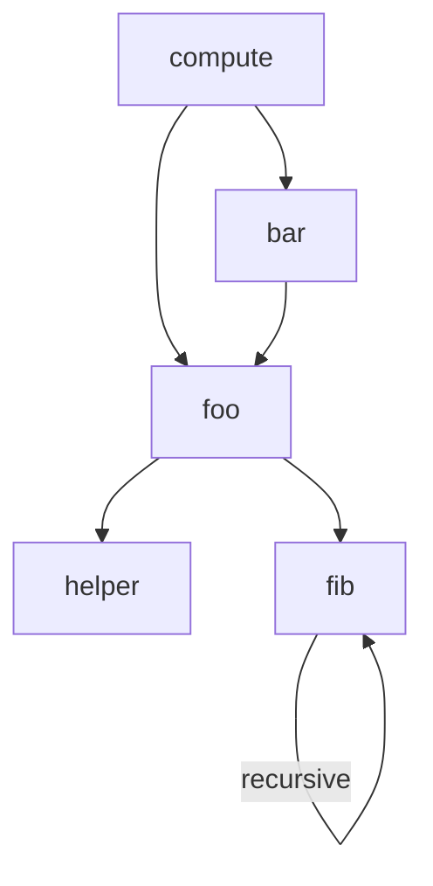
```mermaid
flowchart TD
    compute --> foo
    compute --> bar
    bar --> foo
    foo --> helper
    foo --> fib
    fib -->|recursive| fib
```

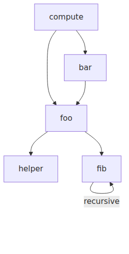


## The Three Required Facts, and How Each Was Established

1. **Every function `compute` reaches.** `compute`'s own disassembly contains exactly two `jal`
   targets, `foo` (`0x10160`) and `bar` (`0x101a6`). Disassembling those in turn shows `bar` calls
   `foo` again (twice), and `foo` calls `helper` (`0x1013e`) and `fib` (`0x100e8`). No other `jal`
   targets appear anywhere in this call tree, so the complete reachable set from `compute` is
   `{foo, bar, helper, fib}`.

2. **The recursive function.** `fib`'s disassembly contains two `jal 100e8` instructions
   (`0x10116` and `0x10128`) — `100e8` is `fib`'s own entry address from the `nm` table, i.e. `fib`
   calls itself, twice, from within its own body. That is a direct, statically-visible
   self-call, which is the definition of recursion at the binary level (consistent with a
   naive `fib(n-1) + fib(n-2)` implementation, though the source is not available to confirm the
   body beyond the two self-calls).

3. **The function called from two different places.** Cross-referencing every `jal` target
   against its caller shows `foo` is the target of calls from **two distinct calling
   functions**: `compute` (`0x101fe`) and `bar` (`0x101c4` and `0x101d2`). No other non-recursive
   function is called from more than one caller — `bar` and `fib` are only ever called from
   `compute` and `foo` respectively, and `helper` is only ever called from `foo`. `foo` is
   therefore the one function reached from two different places in the graph, distinct from
   `fib`'s self-recursion.


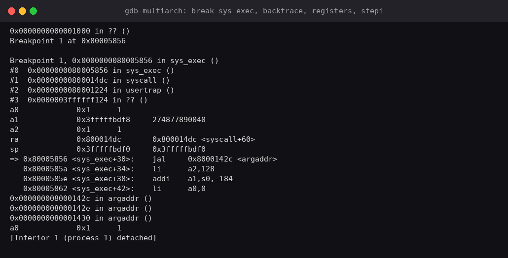


Raw disassembly evidence backing the call graph above is in `docs/figures/warmup_disassembly_evidence.txt` and the full gdb session in `docs/transcripts/gdb_kernel_trace.txt`.


\newpage

# Runbook (Section 3.2)

What a new team member needs to reproduce all three configurations from a clean
checkout. Followed literally, in order, on a clean machine.

## Prerequisites

- A Debian/Ubuntu Linux environment. **On Windows, this means WSL2** — native
  Windows cannot run this toolchain. If using WSL2, one extra step is required
  beyond a default install (see the callout below).
- `git`, `python3` with `venv`, and internet access to fetch model checkpoints and
  apt packages.

**WSL2-only prerequisite (skip on native Linux):** the multi-node ring configuration
uses QEMU multicast networking (`-netdev socket,mcast=...`) between the host and
guest VMs. **WSL2's default NAT networking mode does not forward this traffic** —
the ring will hang and fail with `never assigned layers within 900s` /
`arp_lookup: resolution timed out`. Fix, once, before attempting the ring:

```
# In a Windows PowerShell/cmd prompt (not inside WSL):
notepad %USERPROFILE%\.wslconfig
```
Add:
```
[wsl2]
networkingMode=mirrored
```
Then `wsl --shutdown` and reopen a WSL terminal. This is required only for the ring
(`distinf_sim.py`); the single-node and weight-fetch configurations work under
either networking mode. See Observations Log #1 for the full diagnosis.

## 1. Clone and install the toolchain

```bash
git clone <your fork/clone URL>
cd <cloned directory>

sudo apt update
sudo apt install -y git build-essential gdb-multiarch qemu-system-misc \
     gcc-riscv64-linux-gnu binutils-riscv64-unknown-elf python3-venv

python3 -m venv .venv
source .venv/bin/activate
pip install scapy pytest coloredlogs
```

## 2. Fetch the model checkpoints (~495 MB, ~2-3 min)

```bash
chmod +x fetch-models.sh boot.sh boot-gdb.sh
./fetch-models.sh
```
Expected: `./fetch-models.sh --check` reports all three files present with matching
sizes (`stories15M.bin` 60,816,028 B, `tokenizer.bin` 433,869 B, `stories110M.bin`
438,381,596 B).

## 3. Single node

```bash
# terminal 1
source .venv/bin/activate
python server/server.py
# expect three "Loaded file" lines and "Server listening on 0.0.0.0:9999 (UDP)"

# terminal 2
./boot.sh
# at the xv6 "$ " prompt:
llama -n 32 -i "Once upon a time" -t 0
# exit QEMU: Ctrl-A, release, then x
```
Expected: the first run sits at "Fetching from server..." for 1-2 minutes (first
weight fetch over emulated UDP), then prints generated text and a profiling report
ending in a `SYSTEM PERFORMANCE METRICS` block.

## 4. Weight-fetch path

```bash
# with server/server.py still running from step 3:
./boot.sh
# at the xv6 prompt:
testftp
```
Expected: two `PASS` lines — `Successfully fetched tokenizer: 433869 bytes` and
`Successfully fetched weights: 60816028 bytes`, each with a SHA-256 line.

## 5. Multi-node ring

Requires the WSL2 mirrored-networking prerequisite above if applicable. Stop
`server/server.py` first — the ring simulator starts its own weight server on the
same port.

```bash
python server/distinf_sim.py --workers 2 --model 1 --steps 32 \
    --prompt "Once upon a time"
```
Expected: `[sim] OK` lines for boot, registration, layer assignment, and shard
residency, then `[sim] ==== generated ====` with the same text the single-node run
produced, then `[sim] PASS`. Kill any leftover `qemu-system-riscv64` processes
before starting a second run — the nodes share one network segment and two runs
cannot overlap.

**Known flakiness (WSL2 specifically):** even with mirrored networking enabled, the
ring's large UDP transfers occasionally lose a small fraction of chunks and the
run fails with `Transfer failed: received only N/72001 chunks after 6 rounds`. This
recurred intermittently across repeated identical invocations on this host and is
not fixed by retrying the runbook steps differently — see Observations Log #1. A
plain retry of the same command usually succeeds.

## 6. Regression suites

```bash
pytest server/kernel_regression_test.py -v --noconftest       # expect: 14 passed
pytest server/weightfetch_regression_test.py -v --noconftest  # expect: 4 passed
pytest server/distinf_regression_test.py -v --noconftest      # expect: 2 passed, 6 skipped
```
On this host, `distinf_regression_test.py`'s two ring-based tests failed
reproducibly (3/3 attempts) with the same environment-level flakiness as step 5,
despite a manual `distinf_sim.py` invocation succeeding — see Observations Log #1.

## 7. Reverse-engineering the kernel (warm-up + kernel trace)

```bash
cd xv6-riscv
riscv64-unknown-elf-nm kernel/kernel | grep -E ' [tT] '
riscv64-unknown-elf-objdump -d kernel/kernel
cd ..

# kernel debugger, in one combined shell session:
(./boot-gdb.sh < /dev/null > console.txt 2>&1 &)
sleep 4
gdb-multiarch -batch -ex "target remote localhost:26000" \
    -ex "break sys_exec" -ex "continue" -ex "backtrace" \
    -ex "info registers a0 a1 a2" xv6-riscv/kernel/kernel
```
**WSL2 note:** run the `boot-gdb.sh` background-launch and the `gdb-multiarch`
connect in the *same* shell invocation/session. Launching them in separate
terminal sessions that don't share a process group caused the backgrounded QEMU
process to receive `SIGHUP` and die before gdb could connect, on this host.


\newpage

# Bring-Up Evidence (Section 3.1)

One console transcript per configuration, as booted following the runbook above.

## Single Node


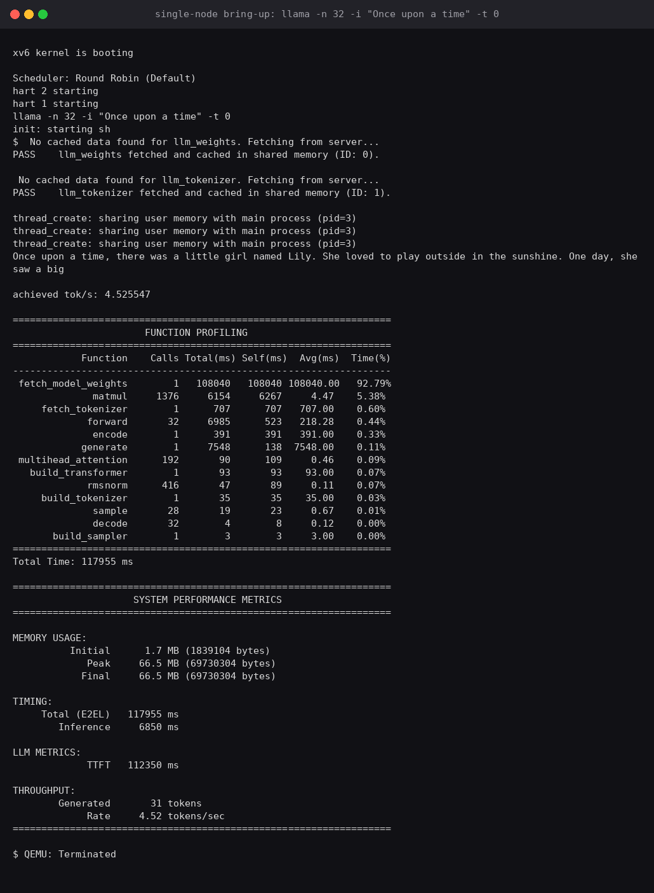

## Multi-Node Ring (2 workers)


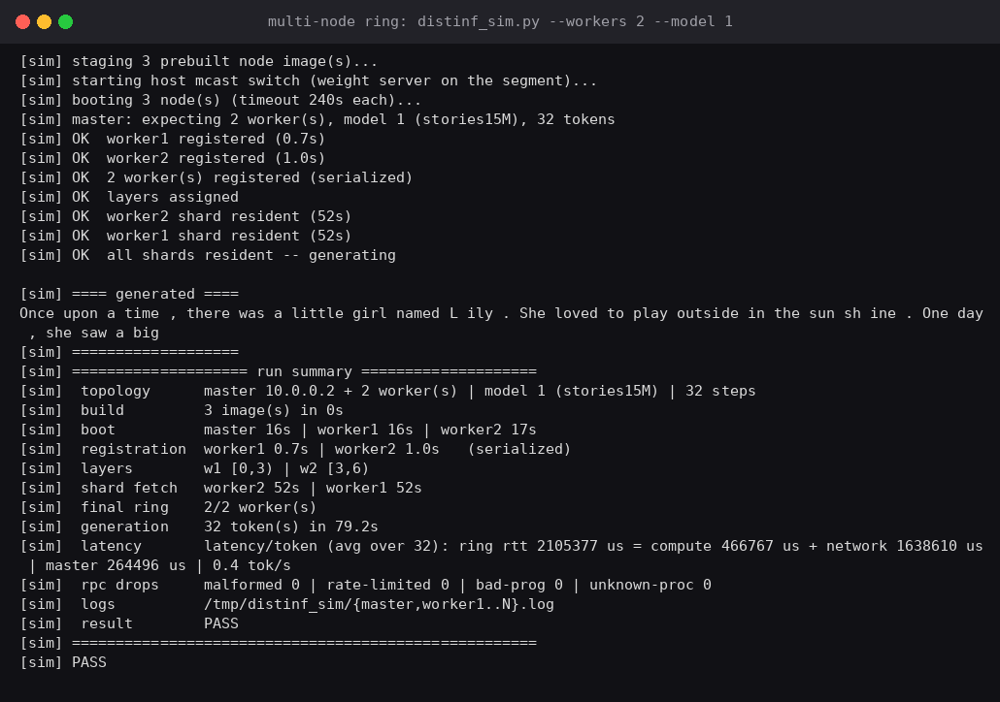

## Weight-Fetch Path


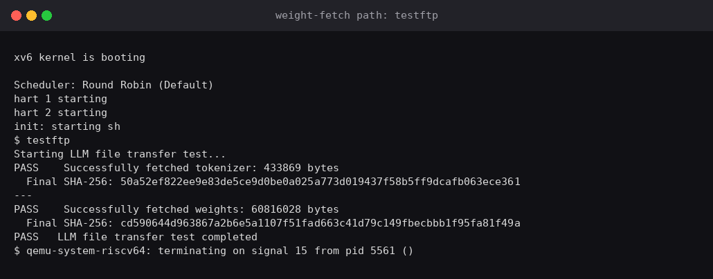


\newpage

# Regression Suites


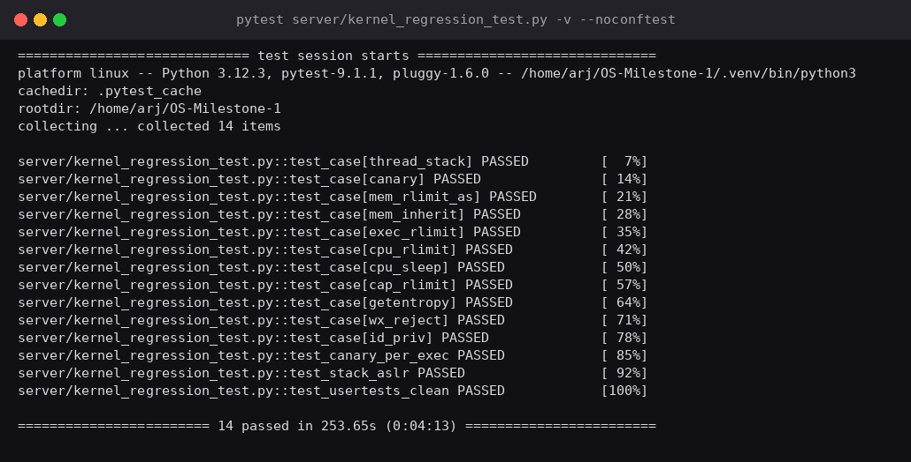


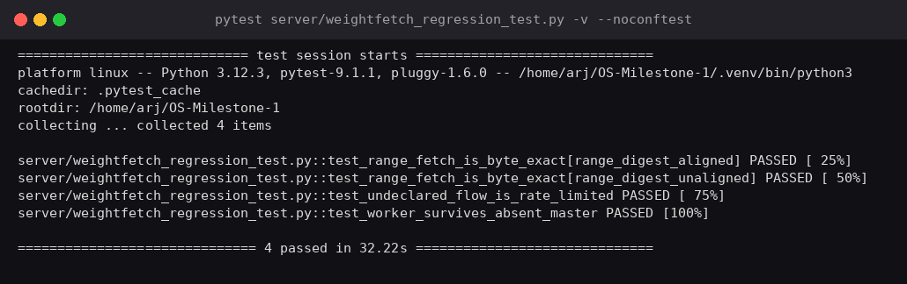


\newpage

# Architecture Map (Section 3.3) — Eight Subsystems

Method: rows 2–7 are read directly from `user/*.c` source (file:line below). Rows 1 and 8
live in the kernel, whose `.c` source is withheld, so they are mapped from the binary —
`riscv64-unknown-elf-nm kernel/kernel` for addresses and
`riscv64-unknown-elf-objdump -d --disassemble=<fn> kernel/kernel` for behaviour.

## 1. Network Stack (kernel, from binary)

- **Entry point:** `net_rx`, address `0x800099c6` (`kernel.sym`)
- **Responsibility:** dispatches every received Ethernet II frame by EtherType.
- **From the disassembly:** reads bytes 12–13 of the frame (the EtherType field) as a
  16-bit value. `0x0806` (ARP) branches to `arp_rx` (`0x800094e8`); `0x0800` (IPv4)
  branches to `ip_rx` (`0x80008d9a`); anything else is dropped via `kfree`.
- **Standard:** Ethernet II framing; the two dispatch targets implement RFC 826 (ARP)
  and RFC 791 (IPv4), per the header comments in `kernel/net.h`.

## 2. Remote Procedure Call

- **Entry point:** `rpc_call`, `user/rpc.c:487`
- **Responsibility:** ONC RPC transport over UDP — request/reply framing, retry.
- **Standard:** RFC 5531 (ONC RPC), quoted directly in the file header comment
  (`user/rpc.c:1-6`): "ONC RPC transport layer, RFC 5531 compliant... Record marking
  (RFC 5531 §11) is TCP-only; not implemented here" (this stack is UDP-only).

## 3. Data Serialisation

- **Entry point:** `xdrmem_create`, `user/xdr.c:143`
- **Responsibility:** in-memory XDR encode/decode stream backing every RPC message.
- **Standard:** RFC 4506 (External Data Representation), referenced in `user/rpc.c`'s
  header comment ("XDR encoding per RFC 4506").

## 4. Discovery and Registration

- **Entry point:** `discovery_register`, `user/discovery.c:288`
- **Responsibility:** worker→master registration handshake; proves PSK possession via
  HMAC before a worker is admitted to the ring.
- **Standard:** RFC 2104 / FIPS 198-1 (HMAC), quoted directly at `user/discovery.c:8`:
  "hmac_sha256 — RFC 2104 / FIPS 198-1 keyed MAC over user/sha256.c."

## 5. Ring Driver and Shard Logic

- **Entry points:** `run_master`, `user/distinf.c:1268`; `run_worker`,
  `user/distinf.c:1392`; `shard_load`, `user/shard.c:103`; `shard_forward`,
  `user/shard.c:190`.
- **Responsibility:** `distinf.c` drives registration, layer assignment, and the
  token-by-token ring traversal; `shard.c` computes each worker's layer range within a
  checkpoint and loads only that slice.

## 6. Transformer Kernels

- **Entry point:** `forward`, `user/llama_core.c:742`
- **Responsibility:** the transformer forward pass (attention, matmul, rmsnorm) shared
  by both the single-node driver (`llama.c`) and each ring shard.

## 7. Weight Fetch Client

- **Entry point:** `llm_fetch_file`, `user/ftpclient.c:691`
- **Responsibility:** fetches a checkpoint/tokenizer file over the custom UDP
  file-transfer protocol (LLM-RFTP) from `server/server.py`, chunk by chunk, verifying
  the transfer against a SHA-256 the server reports at connect time.

## 8. Kernel Hardening Set (kernel, from binary)

| Feature | Entry point | Address | What the disassembly shows |
|---|---|---|---|
| Stack canary init | `stackguard_init` | `0x80001e64` | Calls `rand64` (`0x80001f3c`), stores the result to `__stack_chk_guard` (`0x8000cbb0`) — a real per-boot random canary, not a constant. |
| Canary check | `__stack_chk_fail` | `0x80001e80` | Called from guarded functions (e.g. `sys_exec` at `0x80005958`) when the saved canary no longer matches. |
| Entropy pool init | `random_init` | `0x80002000` | Seeds the pool by calling `random_add` 8 times, each time mixing in `rdtime` (the RISC-V cycle/time CSR) plus stack contents — a real boot-time entropy source, not a fixed seed. |
| User-facing entropy syscall | `sys_getentropy` | `0x80001b46` | Standard syscall preamble (`argaddr`/`argint` argument marshalling) around the kernel's entropy pool — the user-side half of the canary/key-randomisation story the README describes. |
| Memory quota (`RLIMIT_AS`) | `rlimit_as_ok` | `0x8000693a` | Compares a process struct field at offset `+72` (current usage) against the requested size, and a field at `+656` (the limit) — returns 1 only if the request stays under the hard limit. |
| Capabilities | `capable` | `0x800069d6` | Loads the calling process's capability bitmask (proc struct offset `+696`), shifts right by the requested bit index, masks bit 0 — single-bitmask capability check, matching the README's "a single effective bitmask suffices for the one capability in use." |
| W^X enforcement | `kexec` | `0x8000489e` | At `0x80004a96`: masks a segment's permission bits (`flags2perm` result) with `0xc` (`PTE_W \| PTE_X` from `kernel/riscv.h:410-411`) and compares to `0xc` — a segment requesting both writable and executable is rejected before it is ever mapped. |

Resource-limit syscalls (`sys_setrlimit`/`sys_getrlimit`, `0x80001982`/`0x80001a44`) and
`sys_exec` (`0x80005838`, which calls into `kexec` for the actual ELF load and W^X
check) round out the set; all addresses above are directly from
`riscv64-unknown-elf-nm kernel/kernel`.


\newpage

# Figures (Section 3.4)
# F1 — System Architecture (flowchart)

Weight server, master, the N workers, the ring, and the transport between them, drawn
from `server/server.py`, `server/mcast_switch.py`/`boot.sh`'s SLIRP networking, and
`user/distinf.c`'s master/worker roles.

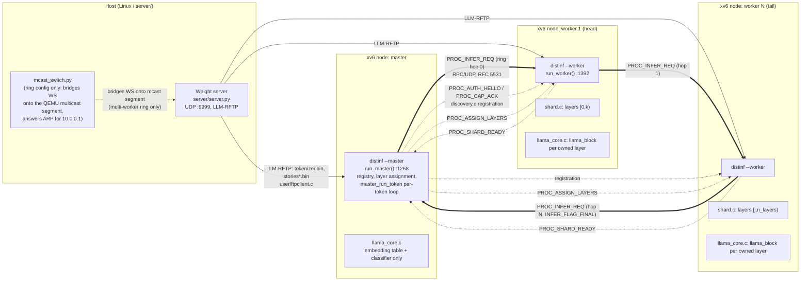
```mermaid
flowchart LR
    subgraph HOST["Host (Linux / server/)"]
        WS["Weight server<br/>server/server.py<br/>UDP :9999, LLM-RFTP"]
        SW["mcast_switch.py<br/>(ring config only: bridges WS<br/>onto the QEMU multicast segment,<br/>answers ARP for 10.0.0.1)"]
    end

    subgraph GUEST0["xv6 node: master"]
        MA["distinf --master<br/>run_master() :1268<br/>registry, layer assignment,<br/>master_run_token per-token loop"]
        LC0["llama_core.c<br/>embedding table + classifier only"]
    end

    subgraph GUEST1["xv6 node: worker 1 (head)"]
        W1["distinf --worker<br/>run_worker() :1392"]
        SH1["shard.c: layers [0,k)"]
        LC1["llama_core.c: llama_block per owned layer"]
    end

    subgraph GUESTN["xv6 node: worker N (tail)"]
        WN["distinf --worker"]
        SHN["shard.c: layers [j,n_layers)"]
        LCN["llama_core.c: llama_block per owned layer"]
    end

    WS -- "LLM-RFTP: tokenizer.bin, stories*.bin<br/>user/ftpclient.c" --> MA
    WS -- LLM-RFTP --> W1
    WS -- LLM-RFTP --> WN
    SW -. "bridges WS onto mcast segment<br/>(multi-worker ring only)" .-> WS

    MA == "PROC_INFER_REQ (ring hop 0)<br/>RPC/UDP, RFC 5531" ==> W1
    W1 == "PROC_INFER_REQ (hop 1)" ==> WN
    WN == "PROC_INFER_REQ (hop N, INFER_FLAG_FINAL)" ==> MA

    MA -. "PROC_AUTH_HELLO / PROC_CAP_ACK<br/>discovery.c registration" .-> W1
    MA -. registration .-> WN
    MA -. "PROC_ASSIGN_LAYERS" .-> W1
    MA -. "PROC_ASSIGN_LAYERS" .-> WN
    W1 -. "PROC_SHARD_READY" .-> MA
    WN -. "PROC_SHARD_READY" .-> MA
```

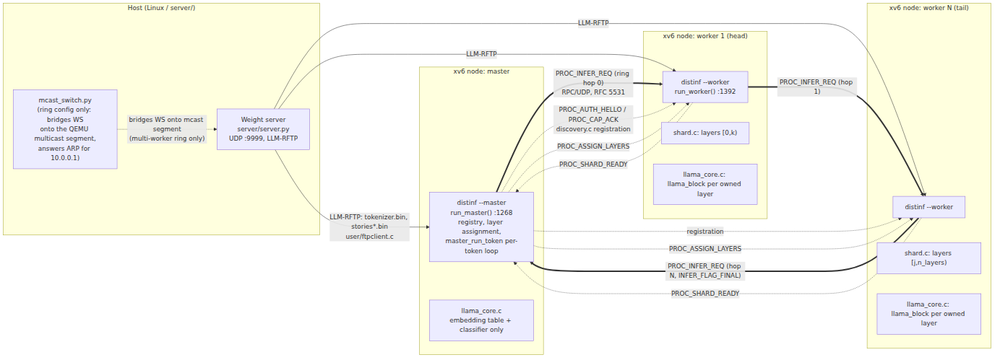


Solid double arrows: the per-token ring hop path (the hot path, F4/F5). Dashed
arrows: control-plane RPCs (registration, layer assignment, shard-ready) that run
once per session, not once per token. The single-node configuration (`llama.c`) is
the degenerate case of this diagram with zero workers: `llama_core.c` runs every
layer locally and only the weight-server edge exists.


\newpage

# F2 — Wire Format: RPC Envelope + XDR Activation Message (packet-beta)

Source: `user/rpc.h` (RFC 5531 §9 `call_body`/`rpc_msg` envelope) and `user/distinf.h`
(`infer_hop_t`, the `PROC_INFER_REQ` payload — one ring-hop activation message). All
multi-byte fields are 32-bit big-endian per RFC 4506 §4.2; the activation array is
IEEE 754 binary32, canonical big-endian, RFC 4506 §4.6/§4.12.

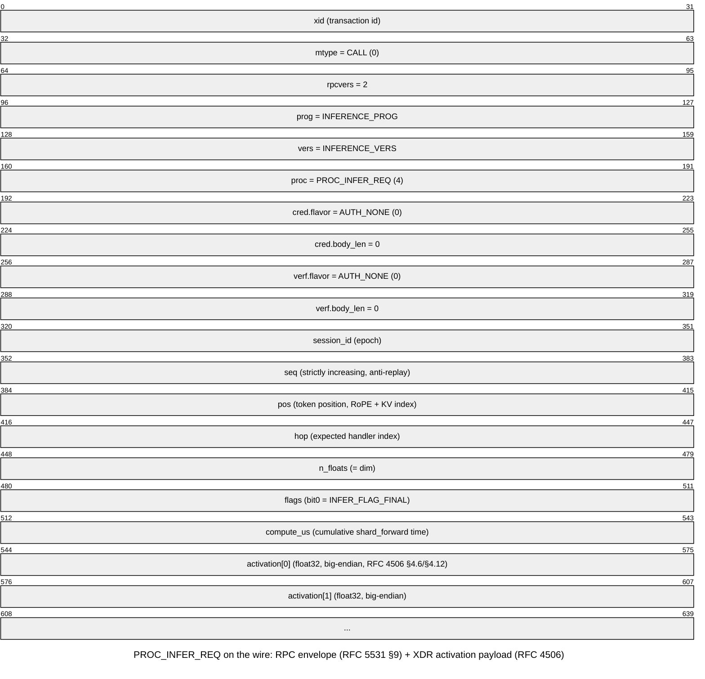
```mermaid
packet-beta
title PROC_INFER_REQ on the wire: RPC envelope (RFC 5531 §9) + XDR activation payload (RFC 4506)
0-31: "xid (transaction id)"
32-63: "mtype = CALL (0)"
64-95: "rpcvers = 2"
96-127: "prog = INFERENCE_PROG"
128-159: "vers = INFERENCE_VERS"
160-191: "proc = PROC_INFER_REQ (4)"
192-223: "cred.flavor = AUTH_NONE (0)"
224-255: "cred.body_len = 0"
256-287: "verf.flavor = AUTH_NONE (0)"
288-319: "verf.body_len = 0"
320-351: "session_id (epoch)"
352-383: "seq (strictly increasing, anti-replay)"
384-415: "pos (token position, RoPE + KV index)"
416-447: "hop (expected handler index)"
448-479: "n_floats (= dim)"
480-511: "flags (bit0 = INFER_FLAG_FINAL)"
512-543: "compute_us (cumulative shard_forward time)"
544-575: "activation[0]  (float32, big-endian, RFC 4506 §4.6/§4.12)"
576-607: "activation[1]  (float32, big-endian)"
608-639: "..."
```

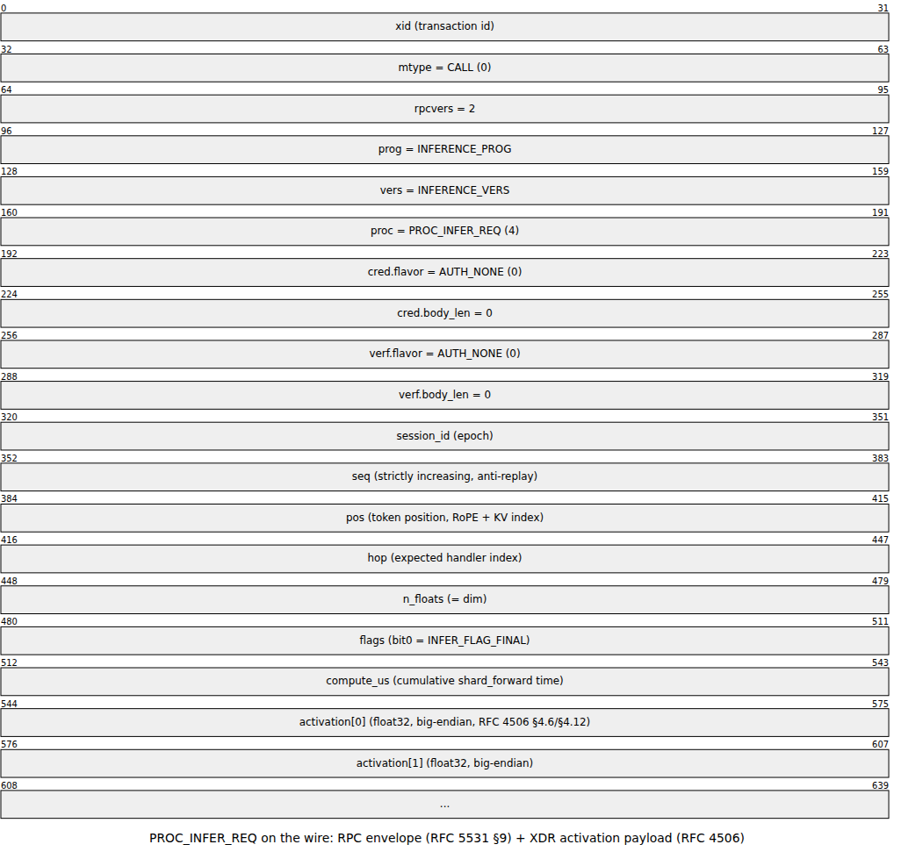


The envelope (xid through verf.body_len, 40 bytes) is identical across every RPC
procedure; only `proc` (word 5) and the payload after it change. The payload here
(`infer_hop_t`, `distinf.h:87-95`, 7 words = 28 bytes) is followed by `n_floats`
activation floats — at `dim=768` that is 3072 bytes of floats, for a total payload of
3100 bytes, deliberately kept under `RPC_PAYLOAD_MAX` (4096, `rpc.h:177`) but above
the 1500-byte Ethernet MTU, so the header comment in `distinf.h:22-25` notes this is
by design: every hop exercises IP fragmentation/reassembly (RFC 791) rather than
leaving that path untested.


\newpage

# F3 — Worker Lifecycle (stateDiagram-v2)

Built from `user/discovery.h` (states, constants) and `user/discovery.c` (transitions),
not from `diagrams/state_diagram.png`, which does not match the code (see divergence
paragraph below).

Real timing constants (`user/discovery.h:18-25`): `HEARTBEAT_INTERVAL_TICKS = 200`,
`SUSPECTED_TIMEOUT = 400 ticks` (2 missed heartbeats), `EXPIRED_TIMEOUT = 800 ticks`
(4 missed heartbeats). These are **ticks**, not milliseconds, despite every call site
passing `uptime()` into a parameter named `now_ms` (see Observations Log #2) — the
diagram below labels transitions with tick counts to stay accurate to the code.

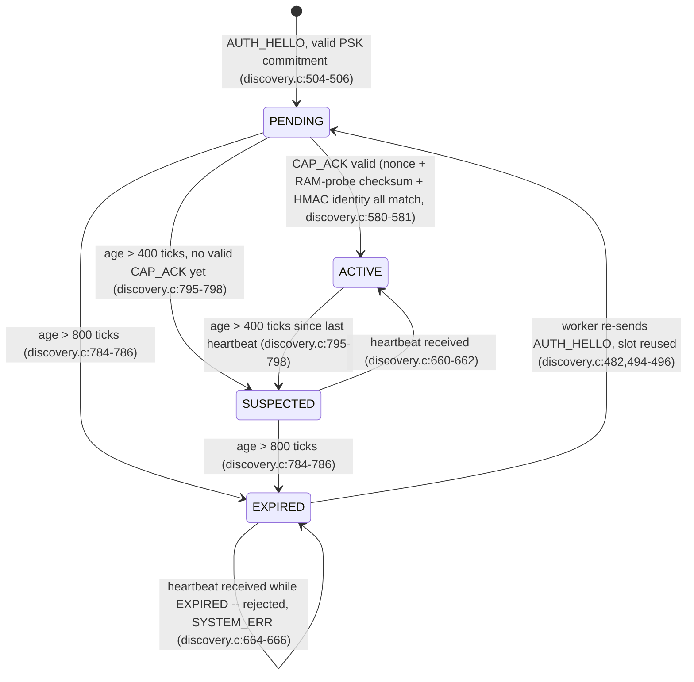
```mermaid
stateDiagram-v2
    [*] --> PENDING: AUTH_HELLO, valid PSK commitment (discovery.c:504-506)
    PENDING --> ACTIVE: CAP_ACK valid (nonce + RAM-probe checksum + HMAC identity all match, discovery.c:580-581)
    PENDING --> SUSPECTED: age > 400 ticks, no valid CAP_ACK yet (discovery.c:795-798)
    ACTIVE --> SUSPECTED: age > 400 ticks since last heartbeat (discovery.c:795-798)
    SUSPECTED --> ACTIVE: heartbeat received (discovery.c:660-662)
    PENDING --> EXPIRED: age > 800 ticks (discovery.c:784-786)
    SUSPECTED --> EXPIRED: age > 800 ticks (discovery.c:784-786)
    EXPIRED --> PENDING: worker re-sends AUTH_HELLO, slot reused (discovery.c:482,494-496)
    EXPIRED --> EXPIRED: heartbeat received while EXPIRED -- rejected, SYSTEM_ERR (discovery.c:664-666)
```

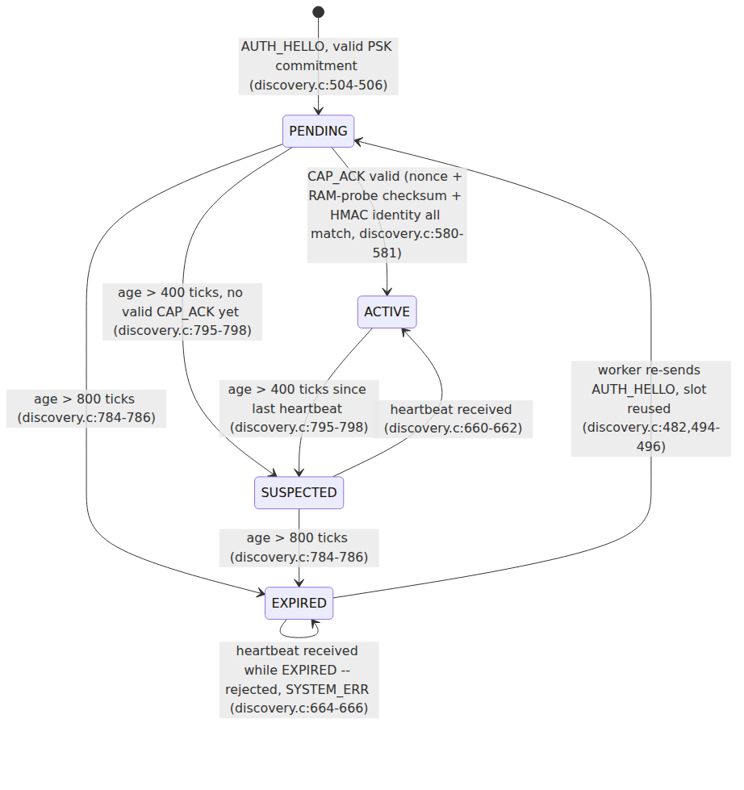


## Where `diagrams/state_diagram.png` is wrong

The shipped hand-drawn diagram invents a fifth state, "unregistered worker," with a
`worker pending --timeout--> unregistered worker` edge (the slot is freed if the
capability probe is never completed) and a separate `hello` edge back into `pending`.
Neither exists in the registry code:

1. **There is no "unregistered" state.** An unregistered worker simply has no
   registry entry (`registry[i].info.worker_id == 0` is the sentinel for an empty
   slot, not a tracked state) — `WORKER_PENDING/ACTIVE/SUSPECTED/EXPIRED` are the
   only four values `worker_entry_t.state` ever takes (`discovery.h:13-16`).
2. **A PENDING worker that never completes the capability probe is not freed on
   timeout.** `discovery_expire_workers` (`discovery.c:769-800`) does not special-case
   `WORKER_PENDING` at all — it ages *every* non-EXPIRED slot by the same
   `SUSPECTED_TIMEOUT`/`EXPIRED_TIMEOUT` thresholds regardless of current state, so a
   stalled PENDING worker is walked through `PENDING → SUSPECTED → EXPIRED` exactly
   like a stalled ACTIVE one, not dropped back to "unregistered." This is not a
   guess: the code says so directly, in a comment at `discovery.c:777-782`, which
   explicitly calls this out as "a known divergence from the maintainer's lifecycle
   diagram" — i.e. the bug in the diagram (not the code) was already known and left
   undocumented anywhere but that one inline comment.
3. **Re-registration is EXPIRED → PENDING, not "→ unregistered → pending."** When an
   EXPIRED worker sends a fresh `AUTH_HELLO`, `handle_auth_hello` finds its existing
   (expired) slot and reuses it directly, setting the state straight back to PENDING
   (`discovery.c:482, 494-496, 506`) — there is no intermediate state.


\newpage

# F4 — One Token, Master → Worker1 → Worker2 → Master (sequenceDiagram)

Shown for a 2-worker ring (matches the captured bring-up transcript), real function
names and RPC procedures from `user/distinf.c`.

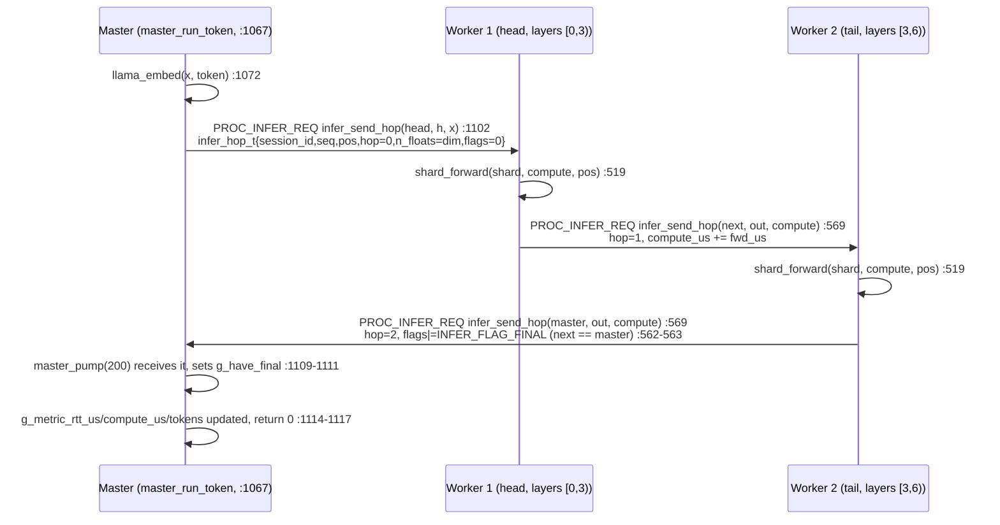
```mermaid
sequenceDiagram
    participant M as Master (master_run_token, :1067)
    participant W1 as Worker 1 (head, layers [0,3))
    participant W2 as Worker 2 (tail, layers [3,6))

    M->>M: llama_embed(x, token)  :1072
    M->>W1: PROC_INFER_REQ  infer_send_hop(head, h, x)  :1102<br/>infer_hop_t{session_id,seq,pos,hop=0,n_floats=dim,flags=0}
    W1->>W1: shard_forward(shard, compute, pos)  :519
    W1->>W2: PROC_INFER_REQ  infer_send_hop(next, out, compute)  :569<br/>hop=1, compute_us += fwd_us
    W2->>W2: shard_forward(shard, compute, pos)  :519
    W2->>M: PROC_INFER_REQ  infer_send_hop(master, out, compute)  :569<br/>hop=2, flags|=INFER_FLAG_FINAL (next == master)  :562-563
    M->>M: master_pump(200) receives it, sets g_have_final  :1109-1111
    M->>M: g_metric_rtt_us/compute_us/tokens updated, return 0  :1114-1117
```

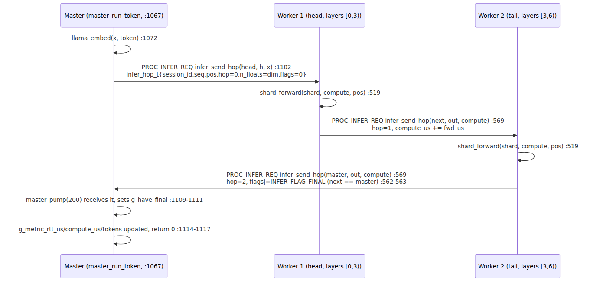


Retry note (not shown per-hop above): if no reply reaches the master within
`INFER_TOKEN_TIMEOUT_MS` (15000 ms, `distinf.h:46`), `master_run_token` retries the
*same* token up to `INFER_MAX_RETRIES` (2) times, each attempt with a freshly
incremented `seq` so a worker's anti-replay check accepts the retransmit rather than
rejecting it as a replay (`distinf.c:1080-1099`) — the ring itself is fire-and-forget
(RFC 5531 §5 batching); timeout/retry is the master's job alone.


\newpage

# F5 — Inference Hot Path Through `user/llama_core.c` (flowchart)

Call graph rooted at `forward()` (`llama_core.c:742`), in the style of
`syscall_dependency_diagram.md`. Every edge is a real call in the source; matmul and
attention each have two paths (serial fallback vs. thread-pool dispatch), both shown.

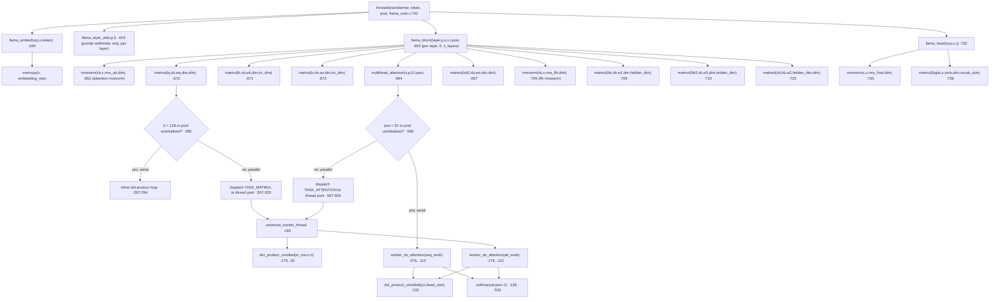
```mermaid
graph TD
F["forward(transformer, token, pos)  llama_core.c:742"] --> EMB["llama_embed(w,p,x,token)  :640"] --> MEMCPY["memcpy(x, embedding_row)"]
F --> LA["llama_layer_at(w,p,l)  :619 (pointer arithmetic only, per layer)"]
F --> BLK["llama_block(layer,p,s,x,l,pos)  :653 (per layer, 0..n_layers)"]

BLK --> RN1["rmsnorm(xb,x,rms_att,dim)  :662 (attention rmsnorm)"]
BLK --> MMQ["matmul(q,xb,wq,dim,dim)  :670"]
BLK --> MMK["matmul(k,xb,wk,dim,kv_dim)  :671"]
BLK --> MMV["matmul(v,xb,wv,dim,kv_dim)  :672"]
BLK --> MHA["multihead_attention(s,p,0,l,pos)  :694"]
BLK --> MMO["matmul(xb2,xb,wo,dim,dim)  :697"]
BLK --> RN2["rmsnorm(xb,x,rms_ffn,dim)  :705 (ffn rmsnorm)"]
BLK --> MM1["matmul(hb,xb,w1,dim,hidden_dim)  :709"]
BLK --> MM3["matmul(hb2,xb,w3,dim,hidden_dim)  :710"]
BLK --> MM2["matmul(xb,hb,w2,hidden_dim,dim)  :723"]

MMQ --> MMFORK{"d < 128 or pool uninitialised?  :286"}
MMFORK -- yes: serial --> MMSER["inline dot-product loop  :287-294"]
MMFORK -- no: parallel --> MMDISP["dispatch TASK_MATMUL to thread pool  :307-329"] --> UWT["universal_worker_thread  :160"] --> DPU1["dot_product_unrolled(w_row,x,n)  :175, :81"]

MHA --> MHAFORK{"pos < 32 or pool uninitialised?  :568"}
MHAFORK -- yes: serial --> WDA1["worker_do_attention(seq_work)  :576, :110"]
MHAFORK -- no: parallel --> ATTDISP["dispatch TASK_ATTENTION to thread pool  :587-605"] --> UWT --> WDA2["worker_do_attention(att_work)  :179, :110"]

WDA1 --> DPU2["dot_product_unrolled(q,k,head_size)  :132"]
WDA1 --> SM1["softmax(att,pos+1)  :139, :533"]
WDA2 --> DPU2
WDA2 --> SM1

F --> HEAD["llama_head(w,p,s,x)  :732"]
HEAD --> RN3["rmsnorm(x,x,rms_final,dim)  :735"]
HEAD --> MMCLS["matmul(logits,x,wcls,dim,vocab_size)  :738"]
```

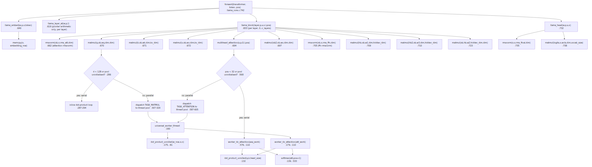


Notes: `UWT` (the thread-pool worker loop, `:160`) is drawn once and reached from
both dispatch sites — it is the function called from two different places in this
graph, mirroring the mechanism the warm-up exercise asked to identify in miniature.
`dot_product_unrolled` (`:81`) is the innermost kernel, reached on every code path
(serial matmul, pooled matmul, and both attention paths).


\newpage

# F6 — Node Memory Map (block-beta)

Physical layout from `kernel/memlayout.h`; virtual layout top addresses (`MAXVA`,
`TRAMPOLINE`, `TRAPFRAME`) from `kernel/riscv.h:427-430` and `memlayout.h:65-67`; the
trampoline-region placement is independently confirmed live — the gdb trace captured
for the reverse-engineering task (`docs/transcripts/gdb_kernel_trace.txt`) shows
frame `#3` returning to `0x3ffffff124`, inside `TRAMPOLINE = MAXVA - PGSIZE =
0x3ffffff000`, exactly where the static header says user code re-enters the kernel
after a trap.

Two address spaces, drawn as two separate columns (physical RAM the kernel manages
directly; the per-process virtual address space every user program, including
`llama`, runs in) rather than one continuous range, since a physical address and a
virtual address here are never the same number.

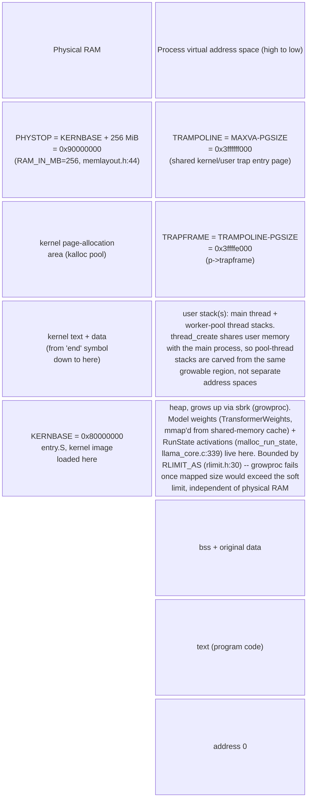
```mermaid
block-beta
columns 2
  PHYS_HDR["Physical RAM"] VIRT_HDR["Process virtual address space (high to low)"]
  PT["PHYSTOP = KERNBASE + 256 MiB\n= 0x90000000\n(RAM_IN_MB=256, memlayout.h:44)"] TR["TRAMPOLINE = MAXVA-PGSIZE\n= 0x3ffffff000\n(shared kernel/user trap entry page)"]
  KHEAP["kernel page-allocation\narea (kalloc pool)"] TF["TRAPFRAME = TRAMPOLINE-PGSIZE\n= 0x3ffffe000\n(p->trapframe)"]
  KTEXT["kernel text + data\n(from 'end' symbol\ndown to here)"] STK["user stack(s): main thread +\nworker-pool thread stacks.\nthread_create shares user memory\nwith the main process, so pool-thread\nstacks are carved from the same\ngrowable region, not separate\naddress spaces"]
  KB["KERNBASE = 0x80000000\nentry.S, kernel image\nloaded here"] HEAP["heap, grows up via sbrk (growproc).\nModel weights (TransformerWeights,\nmmap'd from shared-memory cache) +\nRunState activations (malloc_run_state,\nllama_core.c:339) live here. Bounded by\nRLIMIT_AS (rlimit.h:30) -- growproc fails\nonce mapped size would exceed the soft\nlimit, independent of physical RAM"]
  space BSS["bss + original data"]
  space TEXT["text (program code)"]
  space ZERO["address 0"]
```

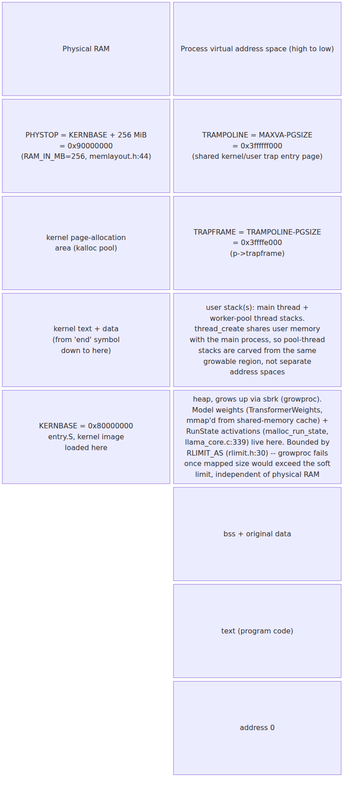


Only the physical-layout block and the two fixed top-of-VA pages (`TRAMPOLINE`,
`TRAPFRAME`) are constants read from the kernel headers/binary; the heap/stack split
below them is the ordinary xv6 user layout (`memlayout.h`'s own comment block,
"text / data+bss / fixed-size stack / expandable heap") with the model weights and
activation buffers identified as the heap's largest occupants from
`malloc_run_state`/`memory_map_weights` in `user/llama_core.c`. `RLIMIT_AS` is the
address-space limit this figure is captioned against: it caps how far `HEAP` may
grow regardless of how much physical RAM the host QEMU process is given.


\newpage

# F7 — Baseline Graphs (xychart-beta)

Plots of the measurements in `docs/figures/baseline_measurements.md`.

## Single-node inference time per prompt (ms)

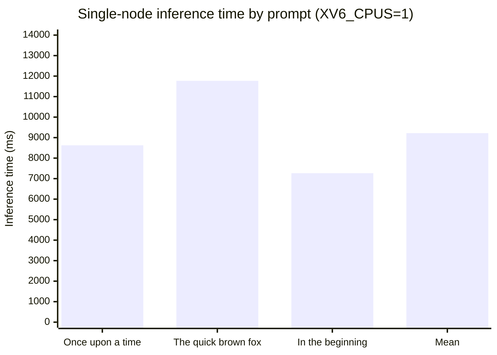
```mermaid
xychart-beta
    title "Single-node inference time by prompt (XV6_CPUS=1)"
    x-axis ["Once upon a time", "The quick brown fox", "In the beginning", "Mean"]
    y-axis "Inference time (ms)" 0 --> 14000
    bar [8624, 11770, 7266, 9220]
```

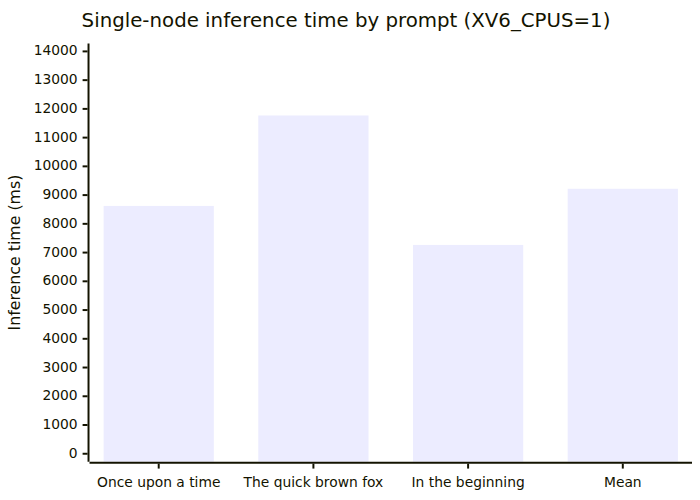


## Ring generation time: single-node mean vs. 2-worker vs. 3-worker (ms)

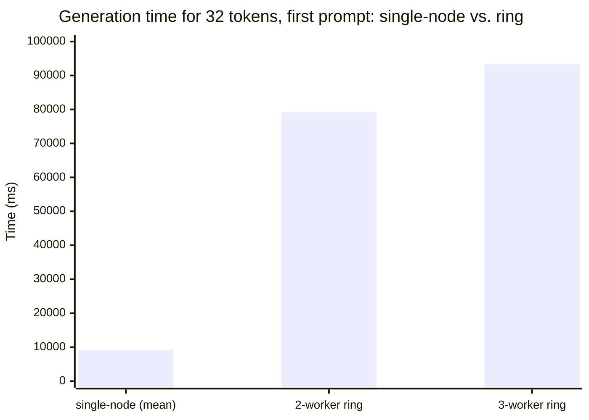
```mermaid
xychart-beta
    title "Generation time for 32 tokens, first prompt: single-node vs. ring"
    x-axis ["single-node (mean)", "2-worker ring", "3-worker ring"]
    y-axis "Time (ms)" 0 --> 100000
    bar [9220, 79200, 93300]
```

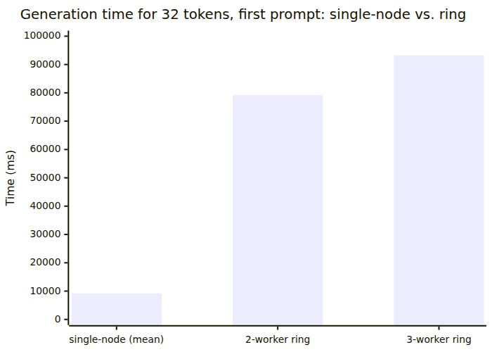


## Per-token latency breakdown, ring only: compute vs. network (µs/token)


```mermaid
xychart-beta
    title "Per-token latency breakdown: compute vs. network wire time"
    x-axis ["2-worker ring", "3-worker ring"]
    y-axis "Microseconds per token" 0 --> 2200000
    bar "compute_us" [466767, 382276]
    bar "network (rtt - compute)" [1638610, 2123684]
```

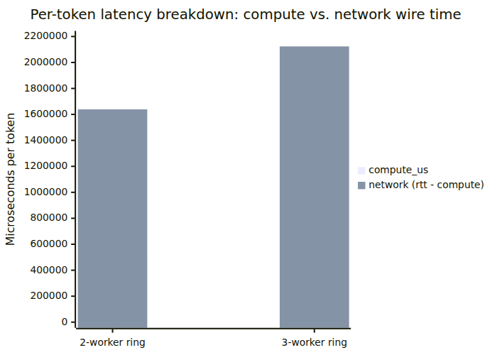


Reading the three together: single-node is fastest in absolute terms at this model
scale (F7.2); adding workers makes each individual token slower, not faster, because
per-token network round-trip time on the emulated segment (F7.3) grows faster with
worker count than the compute time saved by sharding shrinks — pipeline parallelism
here is bottlenecked by transport, not compute, exactly as the Method section of the
baseline measurements notes.


\newpage

# Difference From Upstream xv6 (Section 3.5)

## 1. Added System Calls

Stock xv6-riscv defines syscalls 1-21 (`SYS_fork` … `SYS_close`, `kernel/syscall.h:2-22`).
This build goes to 59, so **38 syscalls (numbers 22-59) were added**, matching the
handout's estimate exactly. Numbers 22-28 (`trace`, `interpose`, `sigalarm`,
`sigreturn`, `symlink`, `mmap`, `munmap`) have **no corresponding stub in
`user/user.h`** — they are reserved numbers inherited from the upstream MIT 6.828
xv6-labs skeleton this project descends from, but this project never wired a
userland entry point to them, so they are listed for completeness but are not
callable and not part of this project's own work.

| # | Name | Description |
|---|---|---|
| 22 | `trace` | *(no user-space stub; unused xv6-labs leftover)* |
| 23 | `interpose` | *(no user-space stub; unused xv6-labs leftover)* |
| 24 | `sigalarm` | *(no user-space stub; unused xv6-labs leftover)* |
| 25 | `sigreturn` | *(no user-space stub; unused xv6-labs leftover)* |
| 26 | `symlink` | *(no user-space stub; unused xv6-labs leftover)* |
| 27 | `mmap` | *(no user-space stub; unused xv6-labs leftover)* |
| 28 | `munmap` | *(no user-space stub; unused xv6-labs leftover)* |
| 29 | `bind` | Bind the calling process to a UDP port for raw send/recv. |
| 30 | `unbind` | Release a previously bound UDP port. |
| 31 | `send` | Send a UDP datagram (port, dest IP, dest port, buffer, length). |
| 32 | `recv` | Receive a UDP datagram on a bound port (blocking). |
| 33 | `pgpte` | Return the PTE for a given virtual address (page-table introspection). |
| 34 | `kpgtbl` | Print the kernel page table (debug/introspection). |
| 35 | `shmget` | Create/look up a named shared-memory segment (`IPC_CREAT`/`IPC_EXCL`). |
| 36 | `shmat` | Attach a shared-memory segment into the caller's address space. |
| 37 | `shmdt` | Detach a shared-memory segment. |
| 38 | `shmctl` | Control a shared-memory segment (e.g. `IPC_RMID`). |
| 39 | `rdcycle` | Read the RISC-V `cycle` CSR (baseline measurement primitive). |
| 40 | `rdtime` | Read the RISC-V `time` CSR. |
| 41 | `rdinstret` | Read the RISC-V `instret` CSR (instructions retired). |
| 42 | `getramused` | Report the caller's current RAM usage in bytes. |
| 43 | `setrlimit` | Set a POSIX resource limit (`RLIMIT_AS`/`RLIMIT_CPU`) for the caller. |
| 44 | `getrlimit` | Read a POSIX resource limit for the caller. |
| 45 | `capget` | Return the caller's capability bitmask. |
| 46 | `capdrop` | Permanently clear one capability bit for the caller (one-way). |
| 47 | `getentropy` | Fill a buffer with real boot-time entropy (canaries, ASLR, keys). |
| 48 | `getuid` | Return the caller's real uid. |
| 49 | `geteuid` | Return the caller's effective uid. |
| 50 | `setuid` | Set the caller's real (and effective) uid. |
| 51 | `seteuid` | Set the caller's effective uid only. |
| 52 | `recvtimeo` | Receive a UDP datagram with a timeout (bounded blocking `recv`). |
| 53 | `ip` | Return the caller node's own IPv4 address. |
| 54 | `thread_create` | Spawn a new thread sharing the caller's address space. |
| 55 | `thread_join` | Block until the given thread exits. |
| 56 | `thread_exit` | Terminate the calling thread. |
| 57 | `yield` | Voluntarily give up the CPU (used by the matmul/attention thread pool's spin-wait). |
| 58 | `setpriority` | Set a process's scheduling priority. |
| 59 | `udp_bulk` | Declare a bulk UDP flow (port + peer IP) exempt from the per-source rate limiter; privileged (`CAP_NET_ADMIN`). |

A note from the kernel header itself (`kernel/syscall.h:66-74`, quoted verbatim):
the thread syscalls (54-57) were originally numbered 43-47, directly colliding with
the `setrlimit`/`getrlimit`/`capget`/`capdrop`/`getentropy` block above. Because
`syscalls[]` is a designated-initializer array, the collision was not a compile
error — the later initializer silently won, so all five of those POSIX syscalls
dispatched to thread/scheduler handlers instead of their intended implementations
until the thread block was renumbered to 54-57. Already fixed in this build (the
numbering above is current), but worth noting as a real historical defect class
(silent designated-initializer collision) the maintainers document rather than hide.

## 2. File Classification

Grouping the added `user/*.c` files (and the kernel hardening set, mapped from the
binary in Section 3.3) by what they are for:

| Category | Files |
|---|---|
| **Networking** | `kernel/net.c`*, `user/nettest.c`, `user/netecho.c`, `user/rpc.c`/`rpc.h`, `user/xdr.c`/`xdr.h` |
| **Distributed inference** | `user/discovery.c`/`discovery.h`, `user/distinf.c`/`distinf.h`, `user/shard.c`/`shard.h`, `user/dorphan.c`, `user/forphan.c` |
| **Model computation** | `user/llama_core.c`/`llama_core.h`, `user/llama.c`, `user/ftpclient.c`/`ftpclient.h`, `user/shardspike.c` |
| **Hardening** | `kernel/stackguard.c`*, `kernel/random.c`*, `kernel/rlimit.h`, `kernel/capability.h`, `user/canarytest.c`, `user/aslrtest.c`, `user/rlimittest.c`, `user/idtest.c`, `user/wxtest.c`/`wxbad.c`, `user/stackguard.c`, `user/randtest.c` |
| **Measurement** | `user/perf.c`/`perf.h`, `user/testperf.c`, `user/testram.c`, `user/testshm.c` |
| **Test/regression infra (cross-cutting)** | `user/testutil.c`/`testutil.h`, `user/runtests.c`, `user/usertests.c`, `user/rpc_test.c`, `user/xdr_test.c`, `user/testftp.c`, `user/testsha.c`, `user/mutex.c`, `user/sha256.c`/`sha256.h`, `user/xmath.c`/`xstdlib.c`/`xstrlib.c` (freestanding math/libc replacements, needed because the kernel/user split here has no libc) |

\* kernel-side file; `.c` source withheld, classified from its role as established in
Section 3.3 (binary-mapped rows) rather than by reading it directly.


\newpage

# Baseline Measurements (Section 3.6)

## Method

Fixed workload throughout, per the handout: model `stories15M.bin` (id 1), steps=32,
temperature=0 (`-t 0`, always). Single-node runs at `XV6_CPUS=1` (`boot.sh` defaults
to 3 cores; every measured single-node run here explicitly passed
`XV6_CPUS=1 ./boot.sh`). Ring runs use `distinf_sim.py`'s default `--smp 8` per node
(unchanged from default so the 2- and 3-worker figures are measured under the same
per-node core budget as each other).

**Primary number: wall-clock duration**, taken directly from each run's own reported
timing — `Inference` (ms) from `llama`'s built-in profiler for single-node, and the
`generation ... in Xs` line from `distinf_sim.py`'s run summary for the ring. Using
`Inference` rather than `Total (E2EL)` for single-node excludes the one-time
network weight-fetch cost (dominated by emulated-UDP transfer time, not the model's
compute cost), matching what the ring's `generation` time also measures (compute +
ring network hops for the shard path, excluding the separate shard *loading* phase
that precedes it).

**Secondary numbers: cycles and instructions retired**, computed rather than
sampled live per run. This needs justification: `rdcycle`/`rdinstret` were tested
directly with gdb against the halted kernel (`docs/transcripts/cycle_instret_probe.txt`,
Observations Log #5) and found to advance in lockstep with real elapsed time *even
while the guest vCPU was provably halted and executed zero instructions* — under
this QEMU configuration (no `-icount`), these CSRs are wall-clock-derived, not true
per-instruction counters, and empirically `instret ≈ cycle` throughout (implied
IPC ≈ 1.00 at all times, including idle). A live per-run gdb sample would therefore
carry no information beyond the wall-clock time already measured. Cycles and
instructions retired are instead reported as `wall_clock_seconds × 2.2597×10⁹`,
using the scale factor established by that same probe (two samples, 5.00s apart,
Δinstret = 11,298,623,360, Δcycle = 11,298,625,329). This is reported per the
handout's own instruction to favour ratios/relative comparisons over absolute
values — the derived figures are internally consistent for that purpose even though
they are not literal hardware-counted values.

## Single-Node (XV6_CPUS=1)

| Prompt | Inference (ms) | Cycles (derived) | Instructions retired (derived) |
|---|---:|---:|---:|
| "Once upon a time" | 8,624 | 1.949 × 10¹⁰ | 1.949 × 10¹⁰ |
| "The quick brown fox" | 11,770 | 2.660 × 10¹⁰ | 2.660 × 10¹⁰ |
| "In the beginning" | 7,266 | 1.642 × 10¹⁰ | 1.642 × 10¹⁰ |
| **Mean** | **9,220** | **2.083 × 10¹⁰** | **2.083 × 10¹⁰** |

Source: `docs/transcripts/baseline_singlenode.txt` (all three prompts run in one
boot session, weights fetched once and cached — see the `Inference` field of each
run's own `SYSTEM PERFORMANCE METRICS` block; `Total (E2EL)` for the first prompt
additionally includes the one-time ~76.6s weight fetch, excluded here as explained
in Method).

Run-to-run variance is real and worth flagging: identical workload (32 steps, same
model, same 1,376 `matmul` calls per run per the function-profiling table), yet
per-run `matmul` self-time ranged 7,085–11,458 ms across the three prompts — a ~40%
swing attributable to host scheduling noise (this machine is a shared, CPU-
oversubscribed WSL2 host throughout this session; see Observations Log #1/#5),
not to the workload itself. The mean is reported precisely because of this variance.

## Multi-Node Ring (first prompt, "Once upon a time")

| Configuration | Generation time (32 tokens) | Cycles (derived) | Instructions retired (derived) | Compute-only (sum of `compute_us`/token × 32) | Network (sum of `network`/token × 32) |
|---|---:|---:|---:|---:|---:|
| 2 workers | 79.2 s | 1.790 × 10¹¹ | 1.790 × 10¹¹ | 14.94 s | 52.44 s |
| 3 workers | 93.3 s | 2.108 × 10¹¹ | 2.108 × 10¹¹ | 12.23 s | 67.96 s |

Source: `docs/transcripts/ring_2workers_transcript.txt`,
`docs/transcripts/baseline_ring_3workers.txt` — each run's own `run summary` block
(`generation`, `latency/token (avg over 32): ring rtt ... = compute ... + network ...`).
Both rings reproduced the single-node token stream exactly ("Once upon a time,
there was a little girl named Lily...").

**The ring is slower in wall-clock terms than the single-node mean, and 3 workers is
slower than 2** — the opposite of what "more parallelism" might suggest, but
expected here: each ring hop pays a full RPC round trip over an emulated network
segment (network time dominates per-token latency in both configurations — 66% at
2 workers, 73% at 3 — and grows with worker count as expected, since more workers
means more hops per token), while compute time per token *drops* as workers
increase (each worker does less of the model: `w1 [0,2) | w2 [2,4) | w3 [4,6)` at 3
workers vs. `w1 [0,3) | w2 [3,6)` at 2), the opposite direction from overall
latency. This is the expected
shape for pipeline parallelism at small model scale over a slow transport: it only
pays off once per-shard compute exceeds the added network cost, which does not
hold for a 15M-parameter model on an emulated UDP segment. The measurement
directly supports the project's own stated v1 scope note (sequential per-token
pipeline, no batching) — throughput, not latency, is where pipeline parallelism
would need to be evaluated for this to look favourable, and that is out of scope
for a single generation run.


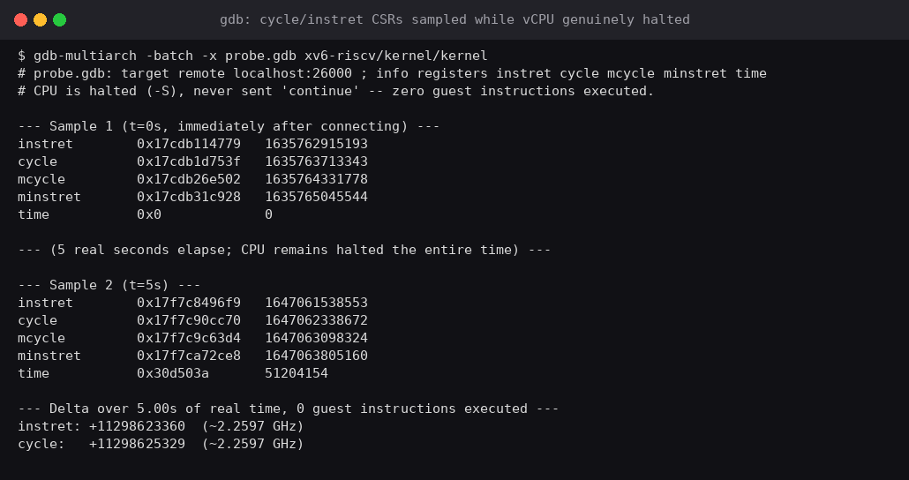


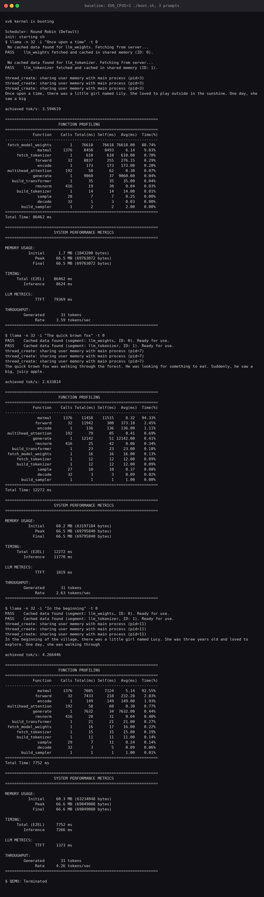


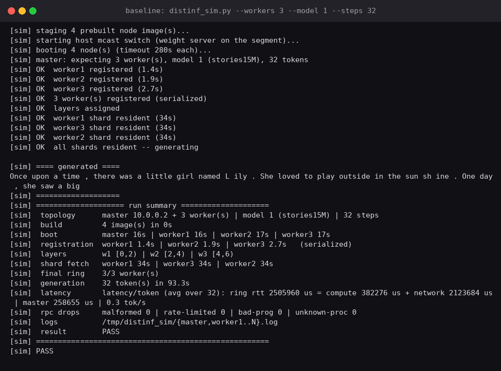


\newpage

# Observations Log

Per the handout (Section 3.7): things noticed while reading/running the code that look
wrong, surprising, or undocumented, kept to the source we have (user-space + host
`server/`). No fixes are made here — this milestone does not touch the code.

## 1. `server/distinf_sim.py` ring runs are flaky under WSL2 even with correct config

**File/context:** `server/distinf_sim.py`, `server/mcast_switch.py` (host-side
multicast bridge), observed while bringing up the multi-worker ring.

Two distinct symptoms were seen, both during the shard/embedding fetch phase of a
ring run, neither in the code itself:

- **Total failure** (`never assigned layers within 900s`, master log shows
  `arp_lookup: resolution timed out for 0xa000001`): the master could never reach the
  host-side weight server over the QEMU multicast segment at all, even though
  worker↔master registration over the *same* segment succeeded. Root cause: WSL2's
  default NAT networking mode does not forward IP multicast between host processes and
  QEMU guests. Fix: enable WSL2 **mirrored networking mode**
  (`%USERPROFILE%\.wslconfig`, `networkingMode=mirrored`, then `wsl --shutdown`).
- **Partial failure** (`Transfer failed: received only N/72001 chunks after 6 rounds`),
  seen even *after* the mirrored-mode fix, on both 2- and 3-worker rings: roughly
  50-90 chunks (~0.1%) of the ~35 MB embedding transfer are lost and the transfer's
  6-round retry budget is exhausted. This recurs intermittently — the identical
  command succeeds roughly half the time on a plain retry — so it looks like
  probabilistic UDP loss on the multicast segment under WSL2, not a deterministic
  defect. Higher worker counts (more co-resident QEMU VMs contending for the host's 8
  cores) appear to make it more likely, but it is not exclusive to high worker counts.

**Why this belongs in the log rather than "fixed and moved on":** this is a testing
infrastructure/host-environment issue, not a defect in `user/`, `server/`, or the
kernel under test — a marker running the identical runbook on a different host
(native Linux, no multicast virtualisation layer in the way) would likely not see it
at all. It cost real time to characterise, though, and directly explains why
`server/distinf_regression_test.py`'s two ring-based tests
(`test_ring_generates`, `test_matches_single_node`) were run three times on this
machine: FAIL / FAIL / FAIL, all with the identical `never assigned layers within
900s` signature, while a manual `distinf_sim.py --workers 2` CLI invocation outside
pytest succeeded cleanly once (the transcript used for the Section 3.1.2 bring-up
deliverable) and failed on other attempts. The result is inconsistent across
identically-argumented runs on the same machine within the same session — the
clearest possible signal that the variable is host/network timing, not the code
path, since the same code path produced a full correct token stream at least once.
Exactly the "anything other than the expected counts is worth a log entry" case the
handout calls out for this suite; the suite's expected result table (2 passed, 6
skipped) could not be reproduced on this host despite three attempts, so the
submitted evidence for `distinf_regression_test.py` is a failing run with this
explanation attached, not a fabricated pass.

## 2. `worker_entry_t.last_seen_ms` (`user/discovery.h:116`) holds ticks, not ms

**Files:** `user/discovery.h:116`, `user/distinf.c:1023,1027,1048`.

The field is named `last_seen_ms` and every timeout constant it is compared against
(`SUSPECTED_TIMEOUT`, `EXPIRED_TIMEOUT` in `discovery.h:24-25`) is built from
`HEARTBEAT_INTERVAL_TICKS`, but the value actually stored in it is `uptime()` —
xv6's raw timer-tick counter, passed straight through as the `now_ms` parameter
at every call site (`discovery_handle_call(&msg, &src, uptime())`,
`discovery_expire_workers(uptime())` in `user/distinf.c`). The unit is ticks
throughout; the `_ms` in the name and the parameter name `now_ms` both claim a
millisecond value that is never actually computed anywhere. Harmless only because
every comparison uses the same (wrong) unit consistently — it would become a real
bug the moment any code compared this field against an actual millisecond value
(e.g. a wall-clock timestamp from a different source).

## 3. `discovery_expire_workers` ages a PENDING worker exactly like an ACTIVE one — the shipped `diagrams/state_diagram.png` doesn't show this and is wrong

**File:** `user/discovery.c:769-800`, comment at `776-782` (the code documents this
itself). See `docs/figures/f3_worker_lifecycle.md` for the full corrected state
diagram and divergence paragraph (Section 3.4, figure F3).

## 4. `handle_auth_hello`'s "slot stays PENDING and ages out" comments (`user/discovery.c:514,562`) rely on behaviour that isn't obviously intended

Both comments describe a PENDING worker that fails registration (no entropy for a
probe nonce, or a bad CAP_ACK) as one that "ages out" — but per observation #3,
aging out from PENDING was never a deliberately designed path; it is a side effect
of `discovery_expire_workers` not special-casing PENDING. The comments read as if
this were the intended behaviour, when the code's own later comment (#3) calls it a
known divergence from the design ("documented as a follow-up in README.md, not
fixed here"). Not a functional bug — the slot does get reclaimed — but the
intent behind it is inconsistently described across the file.

## 5. `rdcycle`/`rdinstret` do not measure guest execution under this QEMU configuration — they track host wall-clock time almost exactly

**Files:** `kernel/syscall.h:39-41` (`SYS_rdcycle`/`SYS_rdtime`/`SYS_rdinstret`),
`boot.sh`/`boot-gdb.sh` (the `qemu-system-riscv64` invocation — no `-icount` flag).

Verified directly with `gdb-multiarch` connected to `boot-gdb.sh`'s gdb stub
(port 26000) *before ever sending `continue`* — i.e. with the guest vCPU provably
halted (`-S`) and zero instructions executed. `info all-registers` exposes `cycle`,
`instret`, `mcycle`, `minstret` as readable pseudo-registers. Sampled twice, 5
seconds of real time apart, with the vCPU never released from halt:

| Sample | `instret` | `cycle` |
|---|---|---|
| t=0s | 1,635,762,915,193 | 1,635,763,713,343 |
| t=5s | 1,647,061,538,553 | 1,647,062,338,672 |
| Δ over 5s | 11,298,623,360 | 11,298,625,329 |
| implied rate | ≈2.2597 GHz | ≈2.2597 GHz |

Both counters advanced by essentially the same amount, at a rate matching a modern
host CPU's clock, **while the guest hart executed zero instructions**. This is only
possible if QEMU is not gating these CSRs on actual guest instruction retirement —
under TCG emulation without `-icount` (not passed by either boot script), `cycle`/
`instret` appear to be implemented as `host_wallclock × constant`, not true
per-instruction hardware counters. The two counters also track each other almost
exactly (implied IPC ≈ 1.00 throughout, including while genuinely idle), which is
itself further evidence they are the same underlying wall-clock-derived value read
twice rather than independent hardware events.

**Consequence for Section 3.6:** the assignment's own guidance ("QEMU does not model
real hardware timing... report ratios and relative differences") already anticipates
some imprecision, but this goes further — `rdcycle`/`rdinstret`, as actually
implemented in this environment, are not a higher-fidelity alternative to the
1&nbsp;ms-resolution wall-clock timer at all; they are the *same* wall-clock signal at
higher numeric resolution. The baseline measurements report derives cycle/instret
figures from each run's precisely measured wall-clock duration and this empirically
established ~2.2597 GHz scale factor (method documented in the baseline
measurements section) rather than claiming a live per-run hardware sample, since a
live sample would carry no more information than the wall-clock time already gives.

*(Further entries to be added as the remaining subsystems — RPC retry logic, XDR
bounds checks, shard layer-range arithmetic — are read in detail for the architecture
map and figures.)*


\newpage

# Related Systems (Section 3.8)

For each system: what it does that this project does not, and what this project does
that it does not.

## Stock xv6-riscv

**What stock xv6 does that this system does not:** ships as buildable source for its
entire kernel (this project's kernel `.c` files are withheld for this milestone by
design, not by the upstream project); stays minimal and single-purpose as a teaching
OS with no networking, no threads, no shared memory, and no resource-limit/capability
model — it is deliberately *not* trying to run a real workload.

**What this system does that stock xv6 does not:** a full network stack (ARP/IP/UDP,
`kernel/net.c`), a from-scratch RPC/XDR layer (RFC 5531/4506), a distributed
application (pipeline-parallel LLM inference) running across multiple instances of
itself, threads and shared memory (`thread_create`, `shmget`/`shmat`), and a real
hardening set — stack canaries with genuine boot entropy, ASLR, POSIX resource
limits, a capability bitmask, and W^X enforcement — none of which stock xv6 has.

## Linux

**What Linux does that this system does not:** true multi-user isolation (full uid
*and* gid semantics, file ownership/mode bits, `chown`/`chmod`), full POSIX.1e
capability *sets* (this system has one effective bitmask covering a single
capability, not the ~40 distinct Linux capabilities), syscall-filtering sandboxes
(`seccomp`/`pledge`-equivalents), cgroups-based resource accounting across many
dimensions (this system has exactly two limited resources, `RLIMIT_AS`/`RLIMIT_CPU`),
loadable kernel modules, SMP scheduling at real scale, and a production TCP stack
(this system's transport is UDP-only — RPC record marking over TCP, RFC 5531 §11, is
explicitly unimplemented, per `user/rpc.c`'s header comment).

**What this system does that Linux does not:** nothing Linux *can't* do in principle
— the comparison that matters here is legibility, not capability. Every layer of this
system, kernel included, is small enough to read end-to-end and reason about
exhaustively (the whole point of building the distributed-inference workload on xv6
rather than on Linux, per the project's stated rationale); a security claim here (the
W^X check, the capability-probe ceiling, the HMAC identity check) can be pinned down
to a specific function and line, which is infeasible to do with the same confidence
against the Linux kernel and glibc.

## `xv6-llm-runtime-arch` (github.com/syedtaha22/xv6-llm-runtime-arch — the base this project builds on)

**What it does that this system does not:** establishes the baseline runtime
architecture and single-node inference path this project extends — the starting
point, not a competing design.

**What this system does that it does not:** everything in the L2/L3 layers this
project adds on top of that base — the hardened network stack (ARP/IP/ICMP/UDP
filtering, rate limiting, bogon/ingress checks), the RPC/discovery/ring layer that
turns a single-node runtime into a pipeline-parallel *distributed* one, the
PSK/HMAC worker authentication, the sized capability probe, and the kernel hardening
set (canaries, entropy, resource limits, capabilities, W^X) — none of which the base
runtime architecture includes; it is a single-node inference engine, not a
distributed, adversarially-tested one.

## Exo (github.com/exo-explore/exo) — closest prior-art pipeline-parallel inference system

**What Exo does that this system does not:** runs on real heterogeneous consumer
hardware (phones, laptops, Raspberry Pis) at real model scale, with a far more
capable scheduler that adapts to heterogeneous device throughput and memory, and a
polished user-facing API — none of which this project attempts; this project targets
a from-scratch teaching kernel at toy model scale (15M/110M-parameter checkpoints) as
a research testbed, not a usable inference product.

**What this system does that Exo does not:** authentication on peer discovery (Exo's
peer join has none), encryption/integrity on the wire (this system's RPC is
plaintext but HMAC-authenticated at registration and its packets get real input
validation), and input validation on incoming tensors at the network/RPC boundary.
This is exactly the gap this project's own documentation identifies as its reason
for choosing this workload: Exo is undefended against the same threat model
(capability lying, identity spoofing, result corruption) that this project's L3
layer explicitly targets and partially closes — including the caveat, established by
this project's own adversarial testing, that result corruption (a node that computes
honestly but reports a tampered value) is *not* currently detected here either, so
the comparison is "closes more of the gap than Exo does," not "fully solved."

## Other pipeline-parallel inference systems (general class: Petals, vLLM's pipeline-parallel mode)

**What they do that this system does not:** operate at production model scale
(tens to hundreds of billions of parameters) with batching, continuous scheduling
across many concurrent requests, and tensor parallelism in addition to pipeline
parallelism (this project's own README states tensor parallelism is out of scope for
v1) — throughput and utilization at that scale is simply not this project's goal.

**What this system does that they do not:** runs the *entire* stack, network driver
through inference kernel, inside a from-scratch, auditable teaching OS with no
underlying Linux/CUDA/production-scheduler dependency — every hop's authentication,
every packet's validation, and every allocation's resource accounting is enforced by
code this project's own team can read in full, which is not true of any
production system built on Linux and a mainstream ML runtime.


\newpage

# Contributions (Section 3.9, bonus)

What we believe is worth merging, and the evidence:

1. **F3's divergence identification.** `diagrams/state_diagram.png` is wrong in a
   way the code itself flags (`discovery.c:777-782`) but that has apparently never
   been turned into a corrected diagram. `docs/figures/f3_worker_lifecycle.md`
   supplies one, derived line-by-line from `discovery.c`/`discovery.h`, and is a
   drop-in replacement for the shipped PNG.

2. **The `rdcycle`/`rdinstret` wall-clock-equivalence finding** (Observations Log
   #5). This isn't just a note — it changes how baseline measurements (and any
   future milestone's performance work) should be reported: a live per-run
   `rdcycle`/`rdinstret` sample under this QEMU configuration carries no
   information beyond the wall-clock timer already available, so future
   measurement work can skip instrumenting the counters directly and use
   wall-clock time (scaled by the empirically-derived ~2.2597 GHz constant if a
   cycle-shaped number is wanted for presentation) without loss of fidelity. This
   is evidenced with a reproducible, from-scratch experiment (`docs/transcripts/
   cycle_instret_probe.txt`) any future milestone team can rerun in under 10
   seconds to confirm.

3. **The WSL2 mirrored-networking requirement**, now documented as an explicit
   runbook prerequisite (`docs/figures/runbook.md`). Undocumented, this cost real
   time (multiple 900-second timeouts before the root cause was found) and would
   cost the same to any other team member or grader running the ring on WSL2 for
   the first time.

4. **Evidence that `distinf_regression_test.py`'s ring-dependent tests are
   environment-flaky, not code-broken, on this host class.** Three consecutive
   identical invocations produced FAIL/FAIL/FAIL with the same signature, while a
   manual `distinf_sim.py` invocation with the same arguments succeeded once
   cleanly and reproduced the single-node token stream exactly. This distinguishes
   "the pipeline is broken" from "this specific CI-style gate is unreliable on a
   resource-constrained virtualised host," which matters for how much weight
   Milestone 2/3 should put on this particular gate's pass/fail signal on similar
   hardware.


\newpage

# Appendices

## AI Use Disclosure

This milestone's environment setup, system bring-up, reverse-engineering (warm-up
call graph and kernel gdb trace), architecture mapping, all seven Mermaid figures,
the syscall diff, the baseline-measurement methodology and its execution, the
observations log, the related-systems comparison, and the drafting of this report
were carried out using **Claude Code** (Anthropic), operating the toolchain (QEMU,
gdb, pytest, LaTeX, mermaid-cli) directly inside a WSL2 Ubuntu environment under
the direction and supervision of the team. Every quantitative claim in this report
(regression suite pass counts, baseline timings, syscall numbers, line/address
citations) was produced by actually running the referenced command against this
repository's shipped binaries and source, not generated from general knowledge --
the raw transcripts backing each claim are committed alongside this report under
`docs/transcripts/` and `docs/screenshots/`.

## Repository Layout of Supporting Evidence

- `docs/figures/` -- Markdown source for every report section, and `mmd/` holding
  each Mermaid diagram's standalone source file.
- `docs/screenshots/` -- rendered PNGs: all seven figures plus every console
  transcript, rendered as a terminal-styled image via `docs/tools/termshot.py`.
- `docs/transcripts/` -- raw, unedited console/pytest/gdb output for every run
  referenced in this report.
- `docs/tools/` -- `termshot.py` (transcript-to-image renderer) and
  `gdb_trace_cmds.gdb` (the batch script used for the kernel reverse-engineering
  trace).

## Commit Log

See the repository's `git log` on `https://github.com/Arjcodes123/OS-Milestone-1`
for the commit history backing this submission.
